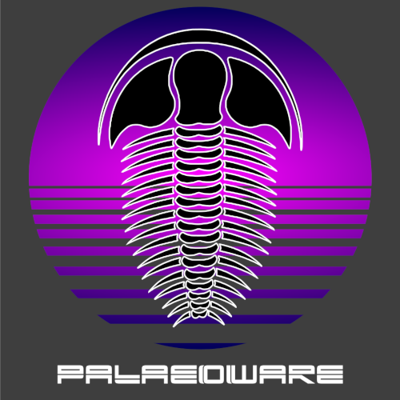

# SPIERS Software

Coded by:

 - Mark Sutton (m.sutton@imperial.ac.uk)
 - Russell J. Garwood (russell.garwood@gmail.com)
 - Alan R.T. Spencer (alan.spencer@imperial.ac.uk)

  

______

## Relevant references:
<b>Sutton, M.D., Garwood, R.J., Siveter, D.J. &amp; Siveter, D.J.</b> 2012. Spiers and VAXML; A software toolkit for tomographic visualisation, and a format for virtual specimen interchange. <a href="http://palaeo-electronica.org/content/issue-2-2012-technical-articles/226-virtual-palaeontology-toolkit"><i>Palaeontologia Electronica</i> 15(2): 15.2.5T</a>

_____

CONTENTS:

1. Copyright and Licence
2. Introduction
3. Installation
4. Minimum Requirements
5. Documentation
6. Contributing to the code
7. Bug reporting and feature requests

_____

## 1. Copyright and Licence

All SPIERS code is released under the GNU General Public License. See LICENSE.md files in the programme directories.

This program is free software; you can redistribute it and/or modify it under the terms of the GNU General Public License as published by the Free Software Foundation; either version 3 of the License, or (at your option) any later version. This program is distributed in the hope that it will be useful, but **without any warranty**.

_____

## 2. Introduction

SPIERS (Serial Palaeontological Image Editing and Rendering System) is a package of three programs for the reconstruction and analysis of tomographic (serial image) datasets, such as those obtained from serial-grinding of specimens, or from CT scanning. More details are available in the documentation for each program.
______

## 3. Installation

SPIERS may be compiled using QT from the source code or installed from the binary releases on our [GitHub](https://github.com/palaeoware).

### Compiling from source

#### Windows 64-bit - QT Creator + QT v5.x and VTK v8.1 using MSYS2 (64-bit) and MinGW (64-bit)
We recommend you install and use MSYS2 (64-bit) a Windows package manager, based on modern Cygwin (POSIX compatibility layer) and MinGW-w64, that allows easy installation of QT v5.x 64-bit and VTK v8.1.

1. Download and run the latest version of MSYS2 https://www.msys2.org/ for 64-bit Windows. This will be name "mysys2-x86_64-..." for the 64-bit installer.
2. Follow the install instructions. We have used the default install location of "C:\mysys64\" and it is here that includes required in the .pro files point. If you install MSYS2 to another location the .pro files will need to be updated to your install location.
3. Once installed open up MSYS2 shell and run the pacman update command: pacman -Syu Note that as this will almost certainly update pacman itself you may have to close down and restart the MYSYS2 shell before re-running the command to finish.
4. Once MSYS2 and pacman are fully updated run the following command to install QT 5.x and its dependencies: pacman -S mingw-w64-x86_64-qt-creator mingw-w64-x86_64-qt5
5. (OPTIONAL) If you intend on debugging the software in QT and wish to use GDB then run the following to install the matching GBD debugger: pacman -S mingw-w64-x86_64-gdb
6. At this stage you should have the following under the MYSYS2 install location:
- {install location}/mingw64 (Main ming64 folder)
- {install location}/mingw64/bin/qmake.exe (QMake for QT version)
- {install location}/mingw64/bin/g++.exe (C++ complier)
- {install location}/mingw64/bin/gcc.exe (C complier)
- {install location}/mingw64/bin/gdb.exe (Debugger | OPTIONAL)
7. We now want to install the VTK v8.1 package. To do this run the following command: pacman -S mingw-w64-x86_64-vtk
8. You should now be able to find the required libraries under "{install location}/mingw64/bin" and the required header (.h) files for QT v5.x and VTK v8.1 under "{install location}/mingw64/include".
9. Use the information above to setup a new 64-bit ming64 kit under QT creator and follow standard QT Creator debug/release procedure.

#### Ubuntu 18.04 64-bit - QT Creator + QT v5.x and VTK v7.1 using GCC (64-bit)

1. Install GCC and QT5.X on your system. You can do this two ways, by using system packages:

`sudo apt-get install build-essential libgl1-mesa-dev`

`sudo apt install qt5-default`

Or by downloading and running the installer from Qt: https://www.qt.io/download Further instructions are available here: https://wiki.qt.io/Install_Qt_5_on_Ubuntu

2. SPIERSview requires VTK: The Linux version of SPIERSview is currently employs VTK7.1. This can also be installed from the Ubuntu packages:

`sudo apt-get install libvtk7-qt-dev`

3. Using the above package, you should be able to find the required VTK libraries under /usr/include/vtk-7.1/ They can also be included, if needed, in the working directory, and added to the executable at link time using the QMAKE_RPATHDIR variable - e.g. #QMAKE_RPATHDIR += $$PWD/vtk-7.X/

4. Download source code, or clone using Git:

`git clone https://github.com/palaeoware/SPIERS.git`

You can then be able to compile SPIERS by opening the .pro file in QT creator and following standard debug/release procedure. The resulting executables will be placed in their individual bin folders: copy these to a single directory to allow SPIERSedit to launch SPIERSview.

5. Alternatively you can build using the following commands -  navigate into the SPIERS source folder in a terminal window:

`cd SPIERS`

Create a makefile:

`qmake ./SPIERS.pro`

Build by running the make command:

`make`

You can then copy the executable files to your desired location, for example, the below will place the files in the SPIERS root directory:

`cp SPIERSalign/bin/SPIERSalign64 ./`

`cp SPIERSedit/bin/SPIERSedit64 ./`

`cp SPIERSview/bin/SPIERSview64 ./`

The executables need to be in the same folder to allow SPIERSedit to launch SPIERSview.

6. Should you wish to create desktop icons or for SPIERS to appear in your launcher, we provide exemplar desktop entries in the SPIERS/examples folder of the repository, coupled with icons for these. Place the icons in the same folder alongside the executable files, and place this folder wherever you would like it to live on your system. The edit the paths to the executables and icons by replacing XXXXX in the example files with your path. Double clicking on the desktop entry will ask you to trust and launch the program. Placing the entry on your desktop will create an icon that launches the software. Additionally, if you open a terminal at the location where the desktop entry is stored, and copy it from there to /usr/share/applications/ using this command

`sudo cp SPIERSalign.desktop /usr/share/applications/`

`sudo cp SPIERSedit.desktop /usr/share/applications/`

`sudo cp SPIERSview.desktop /usr/share/applications/`

This will create entries for each package in the GNOME activities overview / launcher.

#### macOS Catalina 64-bit - QT Creator + QT v5.x and VTK v8.2 (via Homebrew) using Clang 64-bit/XCode 11 toolchain

1. Install XCode 11 from Apple App Store.
2. Install QT5.x/QT Creator from https://www.qt.io/download.
3. Install Homebrew (https://brew.sh/).
4. Get VTK 8.2 package via Homebrew - you may need to force Homebrew to install a specific VTK version see Homebrew instruction on how to do so:

`brew install vtk`

5. Check/Update the path to the VTK package in the ./SPIERSview/SPIERSview.pro file, where "8.2.0_10" is your installed version number:

'LIBS += -L$$PWD/../../../../../../usr/local/Cellar/vtk/8.2.0_10/lib/ \'

6. You should then be able to compile SPIERS by opening the .pro file in QT creator and following standard debug/release procedure.

Note: it may be possible to install QT5.x/QT Creator via Homebrew rather than via the Apple App Store.
_____

## 4. Minimum Requirements

SPIERS is designed to run on a wide range of hardware, rather than being restricted to workstations. The exact requirements for use depend on the data being processed.

_____

## 5. Documentation

All documentation for SPIERS is online at Read the Docs. Links are found on the [SPIERS website](https://spiers-software.org/). This is a version controlled user manual automatically parsed from the .rst found under the docs folders in our software folders.

_____

## 6. Contributing to the code

Contribution to the code in this repository is welcome. Please read the [Repository Contribution](https://github.com/palaeoware/repoconventions)  document for a guide to our coding style and repository structure before submitting any code updates.

_____

## 7. Bug reporting and feature requests

Bug reporting and feature requests should be made through the [GitHub Issues](../../issues) page for this repository. We will aim to respond to all issues and feature requests in a timely manner.

_____

w:spiers-software.org/

t:@palaeoware

e:palaeoware@gmail.com

w:https://github.com/palaeoware
