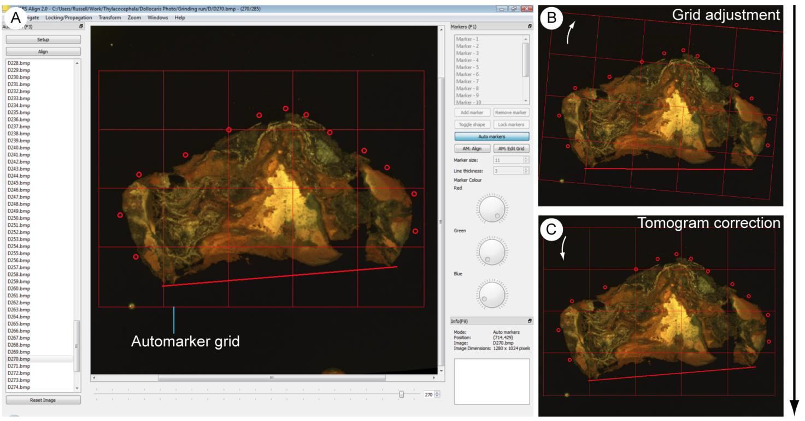

.. _automatedalignment:

Automated Alignment
===================

Semi-automated Align
--------------------

The *Semi-automated Align*, or automated markers system is a fast way of aligning images using the markers system. To do this markers should be placed to pick out fiduciary markings and features of interest, as outlined above, on the datum image. Automated markers should then be toggled by clicking the *Auto Markers* button in the *Markers* panel. This places a grid over the markers and underlying images (Fig. 4A). The user can then navigate through the dataset. When viewing an image requiring alignment, clicking and dragging the mouse can manipulate the automarker grid. Dragging the corners will rotate the grid, and anywhere near the centre will physically drag it (Fig. 4B). The markers will be move with the grid, allowing them to be aligned with the features of interest or fiduciary marks in the underlying image. When the markers lie in the correct position relative to the fossil, the button *AM:Align* (keyboard shortcut Alt-A) aligns the slice (Fig. 4C). This is done by returning the grid and markers to their original positions – which were defined on the datum image – and applying the same 'correcting' transformation to the current image. This process can then be repeated moving through the dataset.

Semi-automated alignment is best suited to datasets with drilled fiduciary holes or no fiduciary features; markers can be placed over each hole or parts of the specimen and the slice corrected; an entire dataset can be rapidly in this way, although subsequent finer adjustments are likely to be required.

	
    Figure 4. The default user interface of SPIERSalign with semi-automated alignment toggled. Note the grid in addition to the markers; this is shown superimposed on the reference tomogram. B. An unaligned tomogram, with the grid rotated (white arrow) to align the markers with the boundaries of the fossil. C. The same tomogram, aligned by resetting the grid and transforming the underlying image.
	
Clicking *AM:Edit Grid* in the *Markers* panel allows the user to change the size, position and line thickness of the grid, in addition to the number of cells. Clicking the *Auto Markers* button in the *Markers* panel will turn off automated markers, allowing markers to be readjusted and used as usual. While using *Auto Markers* it is not possible to add or remove, or adjust the position, colour thickness or shape of the markers.

True Automated Align (Auto Align)
---------------------------------

SPIERSalign provides a facility for the automated alignment of images based upon straight edges within the image. This algorithm will only work on datasets which possess two non-parallel fiduciary edges throughout the zone to be aligned. The system has its own panel (*Auto Align*, F3) showing the options for auto aligning - the panel should open in the left docking area when a dataset is loaded. Before alignment can occur, the user should click the *Setup* button; this displays two boxes on the image, one horizontal and one vertical. These should be placed over the edges upon on which the alignment is to be performed by resizing, dragging and rotating the boxes. These 'edge zones' should cover as much of the fiduciary edges as possible, on every image to be aligned, but without overshooting the edge on any image. Neither box should be rotated more than sixty degrees from their original position. They can go over the edge of the image (i.e. the top, bottom left or right boundary of the file) but should not be placed entirely off the image (Fig 5).

	
    Figure 5. Auto align in setup mode showing the correct placement of setup boxes.

Once these zones are correctly positioned, the user can exit by clicking setup again. An instruction box will appear, explaining the next steps and giving the option of a *Verbose Mode*. This is usually not necessary – if chosen it will display the line equations for the detected edges on both datum and subsequent images, and the required adjustment of the current image. The user can then highlight the slices to be aligned in the *Auto Align* selection box. *Clicking Align* in the *Auto Align* panel will then align selected slices against the currently displayed, datum image. Often the setup boxes will have to be quite large on the initial align to satisfy the conditions above, providing sub-optimal aligning. *Auto Align* can be run repeatedly, however, with increasingly tighter setup boxes around the fiduciary edges. This will allow a more accurate alignment, and can align many datasets so they only need minor corrections after three such iterations.

This algorithm only works on straight edges (more details on how it works are available: https://spiral.imperial.ac.uk/handle/10044/1/6334). It does not take into account any scale errors in images. If any of the images are very poorly aligned, the *Reset Image* button will return the image to its original position. Very noisy images could hinder its performance, as can poorly positioned setup boxes – i.e. those which feature a large area without an edge, and those at a low angle to each other.