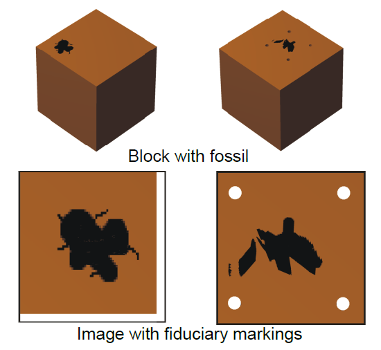

.. _introduction:

Introduction
============

SPIERSalign is a stand-alone program which enables the user to align (or register) and crop a sequence of images (a tomographic dataset) prior to editing and/or reconstruction with SPIERSedit. Although correct alignment is always required for reconstruction, some tomographic datasets (e.g. CT scans) come pre-aligned, and hence this step is not always necessary. Nevertheless, SPIERSalign can be useful for cropping and converting the image format of such datasets. SPIERSalign is primarily a manual alignment tool, which allows the user to move (shift), rotate and rescale each image individually. Automatic alignment tools are provided, but will not always successfully register a dataset. SPIERSalign also provides a facility to define a ‘crop box’ (a region of interest), which will produce a set of cropped images for use in SPIERSedit. Note that alignment is considerably easier and more accurate if there are fiduciary marks in the image whose position is invariant between sections. Such marks include edges cut near the specimen or holes drilled through it (Fig. 1).

	
    Figure 1. Fiduciary markings. Top, blocks with edge (left) and holes for as fiduciary markings. Bottom; photos of blocks showing markings in images