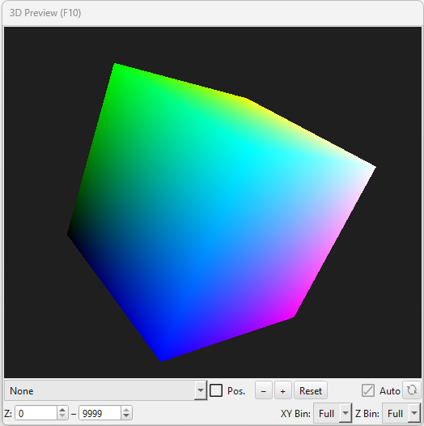

.. _3dpreview:

3D Preview
==========

Concept
-------

The *3D Preview* panel provides a live, in-editor volume rendering of the
current dataset, allowing a user to check the shape and quality of a
reconstruction without leaving SPIERSedit or performing a full export to
SPIERSview. As segments are painted, generation settings are altered, or
output objects are changed, the 3D Preview can rebuild itself
automatically so the effect of an edit can be seen from any angle in
close to real time.

The 3D Preview is intended as a fast, approximate visualisation aid for
use *during* editing, not as a substitute for a proper reconstruction.
The definitive three-dimensional model is always the one exported to
SPIERSview - see *How the 3D Preview differs from SPIERSview* below.

    Figure 1. The SPIERSedit default 3D Preview layout.

Opening the panel
------------------

The 3D Preview is a dockable panel, and can be shown or hidden like any
other SPIERSedit panel, either using the *3D Preview* command on the
*Window* menu, or its keyboard shortcut, *F10*. Like other panels it can
be dragged, floated, resized, or docked alongside other panels as
preferred. When no dataset is loaded, or the panel has not yet built a
render, a rotating debug cube is shown so a user can confirm that the
panel's underlying graphics (OpenGL) is working correctly.

Render modes
------------

The *render mode* combo box at the top of the panel's control bar
selects what the 3D Preview displays:

*None*: The viewport is blank (aside from the debug cube). No data is
built or held in graphics memory. Use this to free up GPU memory and
processing time when the 3D Preview is not currently needed.

*Segments*: The preview is built from the currently *activated* segments
(see the *Segments* panel), coloured using each segment's assigned
colour. This mirrors the same 'best matching activated segment' logic
used elsewhere in SPIERSedit - for each voxel, the activated segment with
the highest working-image value at that location is shown, provided that
value is at or above the standard threshold level (mid-grey, 128); see
*Basic Concepts* for more on thresholding. This is the most useful mode
for general editing, letting a user check segmentation quality slice by
slice, in three dimensions, as they work.

*Outputs*: The preview instead shows the currently visible *output
objects* (see the *Output* panel), coloured using each object's assigned
colour, and restricted to the masks and segments that make up that
object. This mode is useful for checking that output objects have been
defined correctly, and that masks are including or excluding the correct
regions, before committing to a full export.

Navigating the view
--------------------

The 3D Preview viewport can be rotated, panned and zoomed with the mouse:

* *Right mouse drag* rotates the model.
* *Left mouse drag* pans the model.
* *Mouse wheel* zooms in and out.
* *Double-click* in the viewport resets the view.

The control bar also provides equivalent buttons: *−* and *+* to zoom
out and in, and *Reset* to return to the default orientation, zoom level
and pan position.

The *Pos.* (position indicator) checkbox overlays two guides on the
model: a rectangle marking the plane of the slice currently shown in the
main SPIERSedit window, and (while the mouse is hovering over that slice)
a crosshair marking the hovered pixel position. This is useful for
relating a feature seen in the 3D Preview back to a specific location in
the 2D working image, or vice versa.

Region of interest and resolution controls
--------------------------------------------

Because a full-resolution volume render of a large dataset can require a
very large amount of GPU memory, the 3D Preview provides several controls
to reduce the amount of data it builds and displays. These sit in the
lower control bar of the panel:

*Z range* (the two spinboxes labelled *Z:*): Restricts the preview to a
subset of slices, given as a first and last slice number. Slices outside
this range are not loaded or processed at all, which can substantially
speed up rebuilding for datasets where only part of the stack is of
current interest.

*XY Bin*: Sets the pixel sampling stride used when building the preview
within each slice - *Full* uses every pixel, while *½*, *¼* and *⅛*
sample every 2nd, 4th or 8th pixel respectively in both the X and Y
directions. Lower settings build and rotate faster and use much less GPU
memory, at the cost of a blockier-looking preview.

*Z Bin*: Sets the equivalent sampling stride between slices - *Full* uses
every slice, while *½*, *¼* and *⅛* use every 2nd, 4th or 8th slice. The
rendered model is always scaled to the correct physical proportions
regardless of this setting, so reducing *Z Bin* does not squash or
stretch the model - it simply reduces the number of slices sampled to
build it (see *Limitations and known issues* below for an important
caveat on this).

The *XY Bin* and *Z Bin* combo boxes are mutually constrained by
available GPU memory: SPIERSedit estimates the graphics memory required
for each combination of settings and automatically greys out any option
that would exceed what is available, recalculating this whenever the
*Z range* or either binning setting is changed. The *⅛* / *⅛* combination
is always left available as a guaranteed fallback. On opening a dataset,
the 3D Preview defaults to the full *Z range* at *⅛* / *⅛* binning, so
that an initial preview always builds quickly; a user can then increase
resolution as required.

While a preview is being (re)built, a *Loading...* indicator with a
percentage is shown over the viewport; slices are uploaded and displayed
incrementally as they complete, so a partial render is visible
throughout rather than only once the whole build has finished.

Auto Render and Refresh
--------------------------

By default the 3D Preview rebuilds itself automatically whenever
relevant data changes - for example when painting a segment, changing
generation settings, or altering an output object. For some workflows,
particularly on larger datasets, continually rebuilding the preview can
be an unwanted drain on performance.

Unticking the *Auto* checkbox freezes the current render: the model
already shown remains visible (and can still be freely rotated, panned
and zoomed) but no further rebuilding takes place until *Auto* is ticked
again, or the *Refresh* button is used to force a single, one-off
rebuild.

*Turning off Auto Render is also recommended in a few specific
circumstances - see the next section.*

How the 3D Preview differs from SPIERSview
---------------------------------------------

The 3D Preview and SPIERSview both display three-dimensional
reconstructions of a SPIERSedit dataset, but they use fundamentally
different rendering approaches, and are suited to different purposes.

The 3D Preview is a **volume renderer**. Working image data for the
active segments or output objects is packed into a 3D texture, one
coloured voxel per sampled pixel/slice combination, and the graphics card
then ray-casts through this texture, compositing coloured voxels from
front to back along each viewing ray. There is no attempt to fit a smooth
surface to the data - what is displayed is a direct, per-voxel
visualisation of the classified working image data itself, at whatever
XY/Z binning level is currently selected. This makes the 3D Preview very
fast to (re)build, at the cost of a comparatively blocky appearance,
softened somewhat by GPU texture filtering, and a total absence of mesh
simplification, smoothing, or fidelity control.

SPIERSview, by contrast, works from an exported '.spv' file and
constructs an **isosurface** using marching cubes: a triangulated mesh is
fitted around the boundary between 'on' and 'off' voxels for each output
object, at the full resolution and physical proportions specified by the
*Output* panel's export settings (including any output downsampling,
fidelity reduction, and deskewing). This produces the crisp, solid-looking
surfaces seen in finished SPIERSview renders, and is the model geometry
actually used for measurement, further export (e.g. to STL/VAXML), and
publication figures.

In short: the 3D Preview is a quick-look tool for checking segmentation
and output-object definitions as you work, built directly from working
image data at reduced resolution; SPIERSview's isosurface is the accurate,
full-fidelity reconstruction, and should always be used to judge or
present the final quality of a model. Minor differences in apparent shape
or smoothness between the two are normal and expected, and do not
indicate a fault in either.

Limitations and known issues
-------------------------------

*Not a substitute for export*: As explained above, the 3D Preview trades
accuracy for speed. Always check a model in SPIERSview, at full
resolution, before drawing conclusions about model quality, or before
using it for measurement or publication.

*Occasional memory race conditions during ML generation*: The 3D
Preview's automatic rebuilding runs in a background thread that reads the
same in-memory working image and mask data used by the rest of
SPIERSedit. Most editing operations are safe to run alongside an
auto-rebuilding 3D Preview, but the Machine Learning (ML) generation
system processes multiple slices concurrently and does not currently
synchronise with the 3D Preview's background builder in the same way.
Running ML sampling, training, or slice generation at the same time as an
automatic 3D Preview rebuild can occasionally result in a corrupted
preview render, or, rarely, a crash. **It is strongly recommended that
Auto Render is unticked in the 3D Preview panel before running any ML
generation operations**, and only re-enabled (or triggered manually with
*Refresh*) once ML processing has finished. This does not affect the
underlying dataset - it only concerns the live preview render.

*Limited support for non-isotropic downsampling*: The 3D Preview scales
its rendered model using the pixel dimensions and slice count of the
working images currently in memory - it does not currently take into
account the *Slices/mm* and *Pixels/mm* output settings, nor cases where
a dataset's XY and Z dataset downsampling factors differ substantially
from one another. For most datasets, where downsampling is modest and
roughly comparable in XY and Z, this has little visible effect. However
for datasets with strongly non-isotropic downsampling (for example a
dataset downsampled much more heavily in Z than in XY, or vice versa),
the 3D Preview may render the model looking visibly stretched or
squashed along one axis. This is a display-only artefact of the preview:
it does not affect the underlying dataset, and does not affect the
correctly-proportioned model produced by exporting to SPIERSview, which
does account for *Slices/mm* and *Pixels/mm* when building its isosurface.
If a model's proportions in the 3D Preview look wrong, always check the
SPIERSview export before assuming there is a problem with the dataset.

*Graphics memory*: Very large datasets, viewed at high *XY Bin* / *Z Bin*
resolution over a wide *Z range*, can require substantial GPU memory.
SPIERSedit estimates available graphics memory and disables combinations
of settings that would exceed it (see above), but the estimate is
necessarily approximate and may be conservative or optimistic depending
on graphics driver and hardware. If the 3D Preview fails to build or
behaves unexpectedly at high resolution settings, try reducing *XY Bin*,
*Z Bin*, or the *Z range* first.
