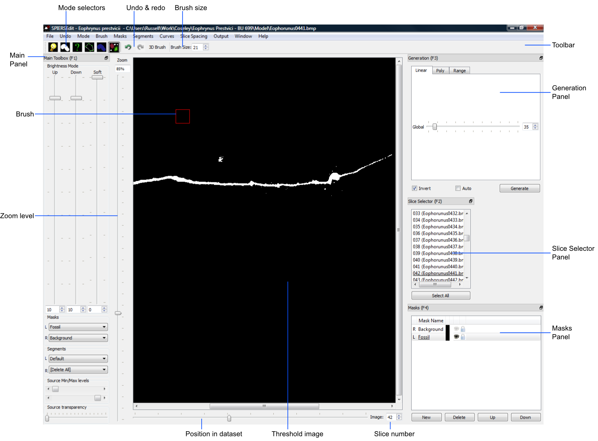
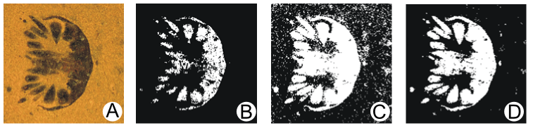
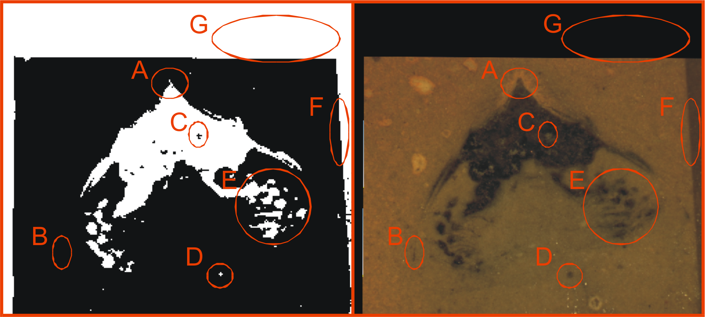
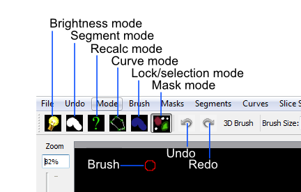

.. _basicconcepts:

Basic Concepts
==============

This section contains key introductory information on using SPIERSedit,
and is arranged in sequence to guide a new user through the process of
constructing and viewing a simple viewable model. More detailed
information on the different facilities SPIERSedit provides is provided
in later sections.

How SPIERSedit Stores Data
--------------------------

The data a user supplies to SPIERSedit is an image ‘stack’; a sequence
of registered images of consistent resolution. These images are
referred to as *source images*. SPIERSedit does not alter source images,
which are retained in their original form as a reference; instead it
creates a corresponding stack of *working images* which it manipulates
and uses as the basis for 3D reconstructions. Working images are always
grayscale, and may be lower resolution than the source images (see
downsampling below). Each dataset has a single SPIERSedit settings file
(with a ‘.spe’ extension), which is stored in the same folder as the
source images. Working images, together with other files corresponding
to each source image, are stored in a subfolder with the same filename
as the dataset's ‘.spe’ file. For example a dataset with a settings file
called *fossil.spe* will have store working images in a folder called
*fossil*. Note that SPIERSedit *requires* that the working images folder
is named in this way – if you rename either folder or settings file the
program will not be able to open the dataset.

Downsampling
------------

Before using SPIERSedit, you will require suitable data using the
guidelines provided above. Prior to importing a new dataset you should
consider the downsampling required. By default, SPIERSedit creates
working images in at the same resolution as source images; for high
resolution datasets this may drastically slow SPIERSedit and produce
models that are too complex for SPIERSview to visualise. One solution is
*dataset downsampling*, where resolution is divided by an integer
factor. For instance, 1000x800 pixel source images might be downsampled
by a factor of 4 to produce 250x200 pixel images for reconstruction
purposes. Downsampling can also be useful to reduce high-frequency
noise. It does of course reduce the detail level in the final model, but
in some cases the extra resolution contains little real information, and
many CT datasets can safely be downsampled by a factor of 2. Dataset
downsampling is defined as a downsample factor within each image (XY
downsampling), and a separate factor for averaging between images (Z
downsampling). Note that source images are never altered by downsampling
or any other SPIERSedit operation. Dataset downsampling has to be
defined when creating a new dataset (the default is XY of 1 and Z of 1 -
no downsampling); while it is possible to change it later on using the
*Change downsampling* command on the *File* menu, it is normally
preferable to get it right initially! Being able to change this
downsampling at a later date allows the majority of preparation work to
be done on a downsampled dataset, which can then be upsampled and
regenerated. This time-saving technique is outlined later.

Creating a New Dataset
----------------------

The first step in making a reconstruction is to import the image stack
into SPIERSedit. To do this use the *New* command on the *File* menu.
Select the source images required for the reconstruction (normally all
the images in a particular directory) and click open. In the window
which appears (Fig. 1) provide a file name (the more descriptive this is
the easier it will be to find in the recently opened files list) and a
brief description of the dataset if required. Alter downsample settings
if required (see above), and tick the ‘back to front’ box if applicable
(see below). Click OK, and after some initial processing a black
rectangle will appear. This is the *threshold image* (see Fig. 2).

.. figure:: _static/figure_1.png
    :align: center
	
    Figure 1. The new dataset window

*Is my dataset front-to-back or back-to-front?* Tomographic datasets
come in two flavours; to understand the difference imagine looking down
on top of the specimen, perpendicular to the slice-plane. In a
front-to-back dataset the first (i.e. lowest numbered) image is the
closest to the viewer, at the top of the specimen; subsequent images
move away from the viewer (down the object). Serial-grinding datasets
are normally of this type. In a back-to-front dataset the first image is
*furthest* from the viewer, at the bottom of the stack; subsequent
images move towards the viewer (up the object). Most CT datasets are of
this type. This setting can be changed later on (using the *Output*
panel), but if you get it the wrong way round your model will be
mirrored!

	
    Figure 2. The SPIERSedit default window layout

Window Layout, Zoom, and Navigation
-----------------------------------

The components of the SPIERSedit window are shown in Figure 2.

On the left and right are panels; these are dockable windows containing
tools, controls and information each designed for different operations.
The default layout is shown in Figure 2, but panels can be dragged and
placed anywhere on the screen, resized, docked in the user interface on
either side (in any desired arrangement), or on top of each other to
create tabbed panels. They can also be ‘floated’ . Panels can be
shown/hidden using commands in the *Window* Menu, or by using the
keyboard shorcuts, which are: *F1* - *Main* Toolbox; *F2* - *Slice*
*selector* panel; *F3* – *Generation* panel; *F4* – *Masks* panel; *F5*
– *Segments* panel; *F6* – *Curves* panel; *F7* – *Output* panel; *F8* –
*Histogram* panel; *F9* – *Info* panel.

The large initially black box in the centre of the screen is the
*Threshold image* (see below); this may or may not incorporate scroll
bars depending on the size of the image relative to the SPIERSedit
window. To its left is the *Zoom level* slider, and below is the
*Position in dataset* slider. The former controls the magnification of
the images shown; shortcut keys *Q* and *A* also zoom in and out
respectively, and zoom values can be typed into the associated
‘spinbox’.

SPIERSedit only displays one image at a time from the dataset. The ','
(back, <) and '.' (forward, >) keys are used to move forward or backward
through the dataset one slice at time. The *Position in Dataset* slider
allows the user to move through the dataset at will; the current slice
number is displayed in the associated spinbox (labelled Slice number in
Fig. 2); values can be entered in here to jump to slices. The title bar
displays the current dataset, and image file path. The *Slice Selector*
Panel, if visible, will also show the current file, as moving to a slice
automatically selects it. Note however that changing selections in this
panel does not move to a different image, but selects images for various
operations discussed later.

At the top of the window, below the menus, is a permanently visible
toolbar – this contains buttons for selecting/indicating which of its
six main editing modes SPIERSedit is currently in, undo/redo controls,
and brush size settings.

Threshold image and Linear Generation
-------------------------------------

The threshold is a binary (black/white) image created from the working
image using a simple rule – all working image pixels brighter than
mid-grey (index value 128 and above) are treated as on, representing
‘object’ (white), and all pixels darker than this value (127 and below)
as off, representing background (black). For palaeontological datasets,
‘object’ normally means fossil, and ‘background’ means matrix (or empty
space for isolated specimens). *The final three-dimensional model
exported to SPIERSview simply consists of all ‘on’ pixels.*

Initally all pixels are off, as no proper working images have get been
generated; when creating a new dataset SPIERSedit simply generates black
‘dummy’ working images. The first step in handling any new dataset is
hence to recalculate working images from source images using appropriate
rules; SPIERSedit calls this process *Generation*, and the appropriate
tools are found on the *Generation* panel.

***To understand how working images, threshold images and simple
generation work, the user is strongly advised to run carefully through
the following exercise for their first dataset.***

a) Press the *Spacebar* a few times, noting that this toggles overlay of
the source image. Leave the source image on, and alter the zoom with the
*Zoom level* slider so the image fits comfortably onscreen. Note that
the keyboard shortcuts for zoom in and zoom out are *Q* and *A*
respectively.

b) For most datasets the first slice does not contain any specimen;
using the *Position in dataset* slider move to a slice that does; if in
doubt move to somewhere near the middle of your dataset.

c) Make sure the Generation panel is visible (see above). On this panel
make sure that the tab at the top is set to *Linear*, leave all the
settings at their defaults, and click the *Generate* button. Nothing
will happen initially as you are viewing the source image, but if you
press the *Spacebar* again a few times to flick between source and
threshold images you will now see some pixels in white on the threshold
image – these are ‘on’ (i.e. SPIERSedit has picked them as ‘object’
using its default rules).

e) With the threshold image visible, try moving the *Global* slider in
the *Generation* toolbox around to alter the rules used by SPIERSedit to
generate the working image; you can either click the *Generate* button
after each change, or tick *Auto* for changes to be automatically
applied as soon as they are made (the latter is normally best, but can
be slow for big images and/or slow computers). Note how more or fewer
pixels can be turned on by moving the slider. If your images have
objects of interest *darker* than matrix (for instance you want to image
voids in a CT dataset), tick the *Invert* box – try this even if your
data are not inverted.

f) In the *Mode* menu, untick *Threshold*. This stops SPIERSedit
thresholding the image, and shows the underlying working image – alter
generation setting again and note how they alter this image. At all
times, the threshold image is simply a version of this working image
with all pixels darker than mid-grey off, and all pixels lighter than
mid-grey on. In normal use you never turn thresholding off, but it is
important to understand how the working image underlies the thresholded
image. When you are happy, turn thresholding back on.

g) So far we have only generated a working image for one slice. Normal
procedure is to determine ‘correct’ settings using a typical slice (see
below), then generate working images for the entire dataset. To do this,
first ensure the *Slice Selector* panel is visible, click the *Select
All* button in this panel. Note that all slices are now underlined – All
SPIERSedit panels used the convention that underlined = selected. Now
click the *Generate* button in the *Generation* panel. It may take a few
minutes for SPIERSedit to generate working images for the entire
dataset. When it has done so, you should be able to move through the
dataset and check that all images now have non-blank working images

The *Generation* panel includes two other tabs, *Polynomial* and
*Range*; these provide more complex rules for generating working images,
and are dealt with under advanced topics. For most datasets, however,
linear generation is adequate. Note that for monochrome datasets (e.g.
CT), only the *Global* slider is available, and essentially just
controls brightness of the working image. For colour datasets (e.g. from
serial grinding) there are also three values for Red, Green and Blue;
these are used to weight the contribution of each of the primary colours
to the monochrome working image. In most colour datasets there is no
need to alter these values from their defaults, but they may
occasionally be useful.

Note that while the source image files are never altered, the
brightness/contrast with which they are displayed can be modified using
the *Source Min/Max levels* slider in the *Main Toolbox* panel. The
source and threshold images can also be combined using the *Source
transparency* slider in the *Main Toolbox* panel, allowing the threshold
image to be viewed below a semi-transparent source image.

‘Correct’ Generation
--------------------

The goal of Generation is to as near as possible automatically
correctly identify which pixels are ‘object’ and which ‘background’;
this involves choosing the best settings before generating for the
entire dataset. Unless datasets are entirely free from noise there will
be no absolutely correct setting, and the goal is to find a setting that
is ‘about right’ – i.e. where the edge of the object is being correctly
identified as much as possible, and as little background as possible is
coming out as white. Toggling between the source and threshold image by
using the spacebar is helpful while judging this. Figure 3 shows a
colour slice-image from a serial grinding dataset (A), and three
attempts at generating a threshold image from it (B-D). Here the fossil
is darker than the matrix, so *Invert* is on. In the first attempt (B),
the *Global* slider is set is too high; although little or none of the
matrix is white in the threshold image and much of the fossil is absent.
In the second attempt (C) the *Global* slider is set too low – although
most of the fossil is white in the thresholded image, far too much
non-fossil material is also coming through. The final attempt (D) is
about right – most of the fossil is white and only a little non-fossil
material is present.

	
    Figure 3. Linear Generation examples. A; source image. B; too dark.(to few white pixels) C; too light (too many white pixels). D; about right.

Generating Multiple Slices
--------------------------

Clicking *Generate* (or altering generation settings with *Auto* ticked)
generates new working images for the selected slices. Normally only the
currently visible slice is selected, but arbitrary sets of slices can be
selected using the *Slice Selector* panel. For simple datasets (e.g CT)
it is only normally necessary to do this once, to all slices, but in
some datasets it may be necessary to use different thresholds for
different slice ranges. For example, in CT, if the strength of the
source varies towards the edge of the detector panel and the first 100
slices and last 100 would need a different global to those in between.
For another example, suppose that in a 100-slice serial grinding dataset
the lighting conditions had to be changed between slices 50 and 51. In
this case, you would generate in two batches – first find good settings
for image 1-50, then select those and generate for them. Next, move to
image 51 (or anywhere else in the second half), find new settings
appropriate for this image, then select images 51-100 and click
*Generate* again.

Editing Requirements
--------------------

Almost universally, datasets will need cleaning (here referred to as
editing); without any such attention, undesirable scattered ‘on’ pixels
and other noise (caused by cracks, artefacts, or other imperfections)
will all be rendered into the final model as floating dots, planes, etc.
Some relatively faint structures may not be picked out by simple
generation rules, and require manual intervention to be identified.
Figure 4 shows some typical problems that could be corrected with
editing.

	
    Figure 4. An image requiring editing. Source image is shown on right and thresholded image on left.  A; lighter than normal structure not fully picked out. B; Thin structure not picked out at all. C; lighter area of fossil-fill identified as matrix. D; dark blob in the matrix (noise) identified as fossil (this identified by eye as non-fossil by tracing it through several images, and confirming that it does not attach to the rest of the specimen). E; set of structures appearing a ‘fatter’ than they should and merged into each other. F; darker background material misidentified as fossil. G; edge-padding introduced during alignment misidentified as fossil.

*Figure 4. An image requiring editing*. Source image is shown on right
and thresholded image on left. A; lighter than normal structure not
fully picked out. B; Thin structure not picked out at all. C; lighter
area of fossil-fill identified as matrix. D; dark blob in the matrix
(noise) identified as fossil (this identified by eye as non-fossil by
tracing it through several images, and confirming that it does not
attach to the rest of the specimen). E; set of structures appearing a
‘fatter’ than they should and merged into each other. F; darker
background material misidentified as fossil. G; edge-padding introduced
during alignment misidentified as fossil.

SPIERSedit does not *require* editing work to be undertaken; once an
initial generation of working images has taken place, any dataset can be
output (visualised) – see below. An initial visualisation prior to any
editing work is in most cases strongly recommended to better assess the
quality of the model possible, and provide a clearer picture of
structures which are hard to identify in slice images.

Editing work can be time consuming, especially if done entirely manually
with the brush, and involves a degree of interpretation, which could be
considered to reduce the objectivity of the data. However carefully
edited datasets produce cleaner-looking three-dimensional models, and
more importantly can bring out anatomical detail not apparent in ‘raw’
unedited reconstructions, for example thin or impersistent structures.
The degree of editing required will depend on the quality of the data,
the time available, and the use intended for the resulting model.

Important Note: Noise consisting of small isolated objects (not joined
to the main specimen, e.g. error type D is Fig. 4) can be removed
automatically using the *Island Removal* facility of SPIERSview; in many
cases this is a much quicker approach than editing the noise out in
SPIERSedit.

Simple Editing
--------------

Editing is undertaken by dragging the *Brush* over the image to alter
it. Editing is a per-slice process – what you do only affects the
visible slice. It can be performed with or without the source image
overlay. The brush appears as a red square or circle (see Fig. 2)
superimposed on the image at the current mouse position. Brush options
are found in the *Brush* menu; these include ten preset sizes and a
toggle to change between a circular and square brush. Brush size can
also be set using the Brush Size spinbox on the menu bar (see Fig. 2).
The ‘3D Brush’ setting allows edits to affect multiple slices, and is
described later in this document.

The effect of the brush depends on the current mode, indicated
(and set) in the mode menu and by the toggle buttons on the toolbar (see
Fig. 5). Mode can also be changed using the keyboard shortcuts, which
are *Ctrl-B* (Brightness mode), *Ctrl-S* (Segment mode), *Ctrl-R*
(Recalc mode), *Ctrl*-*C* (Curve mode), *Ctrl-L* (Lock/selection mode)
and *Ctrl*-*M* (Mask mode). Brightness, recalc and segment mode are
described here (the latter only briefly); a full treatment of segment,
Curve, Lock/selection and Mask modes is given later in this document.

	
    Figure 5. Mode selection toggle buttons.

*Brightness mode:* allows manual cleaning of data by locally adjusting
brightness level of the underlying working image. Brightening (left
click / drag) the area under the brush can ‘push’ certain pixels above
the threshold level, i.e. turn them 'on'; this is the best method for
‘bringing out’ structures that are not appearing in the thresholded
image as they are a little too dark in the working image (e.g. errors A
and B in Fig. 4). Figure 6 shows the effects of brightening – on the
left is the brush about to brighten the threshold image shown, and on
the right is the threshold image following a single left drag with the
brightness brush. Conversely, darkening (right click / drag) will do the
opposite, and is the best method for handling regions where too much
material is ‘on’ (e.g. error E in Fig. 4).

.. figure:: _static/figure_6.png
    :align: center
	
    Figure 6. Effects of brightness brush.

The strength of the brightening and darkening effect from a single
brushstroke can be modified using the *Up* and *Down* sliders in the
*Main Toolbox* Panel; repeated brush strokes over an area (releasing
mouse button between strokes) will strengthen the effect. The brush
effect can be ‘feathered’ so it is stronger nearest the brush centre –
the *Soft* slider in the *Main Toolbox* Panel controls the strength of
this feathering effect.

*Segment mode:* for simple (single-segment) datasets, acts as an
'on' and 'off' drawing tool; the left mouse button turns pixels on, and
the right turns them off. More complex uses of this mode for
multi-segment datasets are dealt with below. Left-clicking in segment
mode (turning pixels on) could for instance be used to cure error type C
in Figure 4, and right-clicking in segment mode (turning pixels off)
could be used to cure error types D, F and G. Note that other approaches
exist for removing large blocks of material; see *Masks* section below.

*Recalc mode:* This re-generates the pixels under the brush using the
current generation settings in the *Generation* Panel, allowing manual
application of different generation rules to isolated areas, or a reset
of an area to an unedited state.

*Undo:* the toolbar also incorporates undo controls; *Ctrl-Z* is the
shortcut for undo, and *Ctrl-Y* is the shortcut for redo. Undo works for
editing actions performed using the brush, but not for operations that
affect entire slices or groups of slices (e.g. generation).

*Tips:* editing successfully using the segmentation and especially the
brightness brush is an acquired skill, practice will considerably speed
a user up! An important trick is to have one hand on the mouse and the
other on the keyboard to constantly overlay and remove the source image
as a guide (using the spacebar), as well as to switch brush modes and
sizes.

Simple Output (Rendering)
-------------------------

SPIERSedit does not itself handle 3D modelling, but exports its datasets
to SPIERSview for viewing in three dimensions. At the simplest level
this is done by using the *View in SPIERSview* command on the *Output*
menu – *F12* is the keyboard shortcut. This command initiates an export
(which may take an appreciable amount of time), then launches SPIERSview
on the exported file. SPIERSview has a separate manual.

In most cases however you will want to review output settings before
using the *View in SPIERSview* command to ensure the model is displayed
correctly; these are available in the *Settings* tab of the *Output*
Panel. The *Slices/mm* and *Pixels/mm* boxes are the most important of
these settings, specifying the scale and aspect ratio of the output
model. *Slices/mm* is the number of slice images per millimetre in the
source dataset; this will be 1/\ *s*, where *s* is the slice-spacing in
millimetres. For example if slices are spaced every 40 microns,
*Slices/mm* should be 1 / 0.04 = 25. *Pixels/mm* is the scale of each
(source) slice image, specified as the number of Pixels per millimetre –
for instance if the field of view is 3mm and the source image is 300
pixels wide, *Pixels/mm* should be 100. For CT data and these two values
are normally the same, and can be calculated as 1 / *v* where *v* is the
voxel size (converted to millimetre).

The *Sequence front to back* tick box is the same ‘front to back’
setting discussed above under *Creating a New Dataset*.

Other output settings are described later in this manual.

Saving and Opening Datasets
---------------------------

Saving in SPIERSedit is essentially automatic. Changes made to
individual images are made directly to disk. Other information, stored
in the ‘.spe’ settings file, is automatically saved when SPIERSedit
exits and autosaved by default every five minutes (the *Advanced prefs*
dialog, accesible via the *File* menu, can be used to change this
default). A manual settings save can be triggered at any time using the
*Save* command on the *File* menu.

SPIERSedit datasets can be re-opened (a) by double-clicking on the
SPIERSedit settings file (.spe), (b) by using the *Open* command on the
*File* menu to open an existing .spe file, or (most conveniently) by
using the *Open Recent* submenu on the *File* menu. The *More...*
command at the bottom of the Open Recent submenu shows all datasets ever
opened by this installation of SPIERSedit.

SPIERSedit does not support multiple datasets – opening a dataset with
the *Open* command will save and close any dataset already open.
Multiple copies of SPIERSedit can be opened instead, though be aware
that SPIERSedit uses a substantial amount of memory for its file cache
(see Advanced Prefs section below), and hence that multiple copies may
quickly use up all available system memory.

The *Save As* command on the *File* menu creates a second copy of the
entire working dataset for backup or other purposes. It does not
duplicate the source data files, but creates a new ‘.spe’ file and
working dataset folder within the source dataset directory.

The *Import SPIERSedit 1.1* command on the *File* menu is not documented
in this manual.

Advancing Beyond Basic Concepts
-------------------------------

The remainder of this manual documents many other features of
SPIERSedit. It is recommended that users intending to make extensive use
of SPIERSedit read through all these sections, but for those in a hurry
the most important sections (in no particular order) are *Masks* (which
allow splitting of a model into colour-coded parts), *Segments* (which
allow for multiple types of material in a model), and *Output* (which
covers how to export and view models with multiple masks and segments).