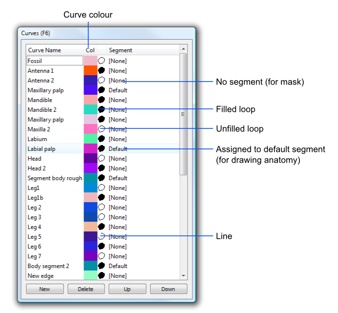
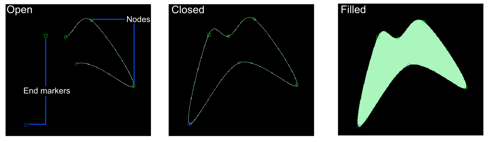
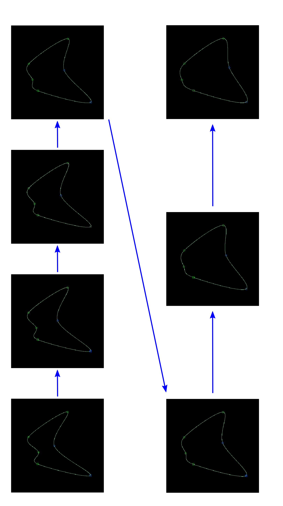

.. _curves:

Curves
======

Concepts
--------

SPIERSedit supports a form of ‘spline’ object (technically Catmull-Rom
splines) which it calls ‘curves’; these are curved lines defined with a
series of points (‘nodes’) through which they pass. Curves can be closed
into loops, and these loops can be filled. They can be used to form
objects in reconstructions by assigning them to a segment, or kept
invisible in final models and used instead to create masks. Curves can
be copied between slices in the same way as masks, and an interpolation
system allows them to gradually change over a series of slices.

Curves rendered directly as objects (i.e. assigned to a segment) can be
used to bring out impersistent or thin linear structures, or as closed
and filled loops to define regions that cannot easily be edited out.

Curves used as a basis for masks, particularly when used with
interpolation, provide an invaluable tool for rapidly masking datasets.
They also greatly aid the consistent definition of arbitrary boundaries,
as these can be defined as straight lines or gentle curves, making the
nature obvious, and neater than drawing such edges in by hand.

Curves are visible in all modes if assigned to a segment, but unless
SPIERSedit is in *Curve* mode they will just appear like normal pixels
of whatever segment they are assigned to. When SPIERSedit is in curve
mode, all curves present on a slice will be visible (in their specified
colour) if assigned to a segment; curves not assigned to a segment are
only visible if selected in the *Curves* panel. Points controlling a
curve are only visible if the curve is selected.

Each curve can only appear once on any one slice. If more than one curve
is needed on one slice then multiple curves must be created. The same
curve can be used to model different objects as long as they never don’t
appear on the same slice, but it is better practice to create a new
curve for each new object. If a large number of curves are used it can
become difficult to keep track of them; the *Grey-out curves not on
current slices* command on the *Curves* menu is provided as an aid to
identifying curves active in the part of the dataset under inspection.

Unlike all other data editing on a per-slice basis, curves are not
stored in separate files but within the .spe file. If many curves are
being used it is hence recommended that the user increases the autosave
frequency (see Advanced Prefs) or manually saves more regularly.

There is no maximum number of curves.

Curves Panel
------------

Curves are listed in the *Curves* panel (Fig. 17), which works in a very
similar way to the *Masks* panel.

	
    Figure 17. The Curves Panel

*Creating curves:* Curves are created using the *New* button on
the *Curves* panel. New curves are given a unique name and colour; by
default they are open and not assigned to a segment. A newly created
curve contains no points; before anything is visible the user needs to
create nodes on slices for the curve.

*Curve Name:* This column provides a reference name for the curve. Edit
by double-clicking.

*Col:* The curve colour (only displayed in curve mode). Edit by
double-clicking.

*‘Loop’ icon*: This specifies the mode of the curve; curves can be open
(a line), closed (an unfilled loop), or filled (a filled loop) (see Fig
18). Double-click to cycle between these three modes.

*Segment*: The segment the curve is assigned to, or [None] if not
assigned. Double click to edit.

*Slices*: [Added v2.14, not shown in Fig 17] – gives the flrst and last
slice on which the curve is used, or ‘Not Used’ if not currently active
on any slice.

*Selecting curves*: One or more curves can be selected by left clicking
on any column of the *Curves* panel. To select multiple curves use
Ctrl-click or Shift-click. Selection is indicated by an underlined curve
name. Selection of curves is used for bulk deleting, copy operations,
and the mask to curve command. A single selected curve is also a
requirement for editing of curves within a slice (see below); nodes will
not be visible unless the curve is selected.

*Re-ordering curves list:* Curves can be moved up and down the list by
selecting a curve and using the *Up* and *Down* buttons. This reordering
only affects how the curves appear in this list.

*Deleting curves*. Select curves in the panel then use the *Delete*
button to remove them.

	
    Figure 18. Curve modes. Note that in Open mode curves have two square end markers, which are specialised nodes through which the curves does not pass, but whose position affects the curvature of the final section. The blue square affects the end with the blue circle, the green square the end with the green circle. When the curve is closed these are treated as normal nodes.

Editing Curves
--------------

Curves are edited on a per-slice basis by adding, removing or moving
nodes. *To perform this sort of editing, a single curve must be selected
in the *Curves* panel, and SPIERSedit must be in curve mode*. Curve
editing uses the brush for position, but brush size is ignored.

*Creating nodes:* The ‘=’ key adds a node to the curve at the current
mouse cursor position. If no nodes exist for the curve on the current
slice, the minimum of 4 are created near the cursor position.

*Removing nodes*: The ‘-‘ key removes a node from the current mouse
cursor position. If this would reduce the number of nodes on the slice
below four, the user is asked if they want to entirely remove the curve
from the slice or not.

*Moving nodes*. Nodes can be moved by dragging with the mouse.

*Removing curves from slices*: curves can be removed from slices by
individually removing all their nodes. The *Remove Curves from Selected
Slices* command on the *Curves* menu provides a quicker way of doing
this in bulk, removing all nodes from selected curves for all slices
selected in the *Slice Selector* panel.

*Curve markers*: By default nodes are indicated with small circles, but
the *Curve Markers as Crosses* setting on the *Curves* menu changes
these to small crosses, which some users may find clearer.

*Locked curves*: If the *Lock curve shape* item on the *Curves* menu is
ticked, dragging any node will move all nodes of the curve rather than
an individual node.

*Resizing curves*: The *Resize curves on selected slices* command on the
*Curves* menu lets the user resize all selected curves on all selected
slices by a specified percentage.

Copying curves
--------------

Curves can be copied between slices using the copy commands in the
*Curves* menu. This works in a way completely analogous to copying
masks; the reader is referred to the masks section for more details.

Interpolating Curves
--------------------

Curves can be interpolated between slices; if, for example, slice 10 and
slice 20 have nodes defined for a particular curve, interpolating
between these slices will gradually alter the curve in between the two
to form a smooth shape change from one to the other. Figure 19
(overleaf) shows a curve interpolated over seven slices.

To interpolate a curve between slices, ensure that the curve is selected
in the *Curves* panel, that all slices involved are selected, and *that
the curve has the same number of nodes* on the first and last slice
selected. The *Interpolate Over Selected Slices* command on the *Curves*
menu performs the interpolation.

There is no need for nodes to already exist on the intervening slices,
but if they do they will be over-written by the interpolation operation.

Defining filled curves at regular intervals (e.g. every 50 slices) and
then interpolating them is a fast way to rather precisely specify
regions to be masked, and is a technique the authors make extensive use
of.

Creating Masks from Curves
--------------------------

As intimated in previous sections, an important use of curves,
especially interpolated curves, is to draw masks. To create a mask from
a curve or curves, select the curve (or curves) in the *Curves* Panel,
select the slices involved in the *Slice Selector* panel (it doesn’t
matter if slices are selected on which the curve does not exist, so
often it’s fine to use the *Select All* button here), and select the
mask which the curve is draw into in the *Masks* panel. To trigger the
operation use the *Mask from curve* command in the *Masks* menu. All
pixels from the curves on all selected slices will then be drawn into
the selected mask.

While curves in any mode can be converted into masks, in almost all
cases the curve should be in filled mode to specify an area rather than
just an outline. Typically it is easier to set up the mask in unfilled
mode, and then put it into filled mode before performing the *Mask from
curve* operation.

Creating a mask from a curve is a one-time copy operation, which does
not create any sort of permanent link. If the curve is later modified,
the area masked by a *Mask from curve* operation based on it will not
update, and the masked area and the curve will no longer be in synch.

	
    Figure 19. Curve interpolated over seven slices