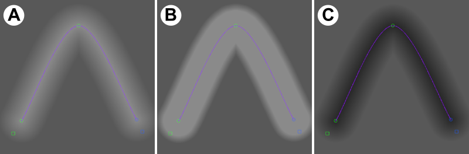
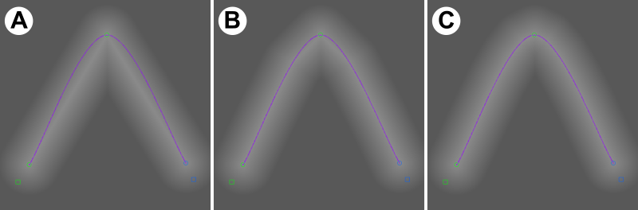

Gradient Generation
================

Concept
-------

Gradients generation is a generation mode that applies a graded brightening or darkening effect in a specific area of a slice-image. It provides an alternative approach to manual brightening or darkening by brush, which can rapidly be applied in a consistent way over a large number of slices. 
 
Like LCE generation, gradients generation does not replace existing working data, but applies a filter to modify it. For the same reasons as LCE, therefore, the 'invert' and 'auto' checkboxes are not available. 

Gradients generation uses the curves system to define a *central line* – pixels are then brightened or darkened according to their distance from that line. Because curves positions can easily be duplicated or interpolated over slices, you can use the gradients system to correct for dark and light regions over many slices, even if those regions do not remain stationary.

Gradient generation uses the concept of a minimum and maximum distance – these are distances from the central line, in pixels, and control the start and end of the gradation effect.

Usage
----------------------

To use gradient generation, you need to have a curve defined and selected to provide the central line. Note that it is only the curve line (not curve fill) that is used, so it is recommended that your curve visualisation mode is set to unfilled, either in open-ended or close-loop mode. If you want a central point rather than a central line, define an open-ended curve with the minimum number of points, and move the two active control points to the same position. Note that you can then move them together by using 'Lock Curve Shape' (Curves menu).

With your curve selected, use Preview mode to inspect the effects of the gradient you are applying, and modify settings to acheive the desired effect. Once you are happy, use the Generate button to permanently apply the effect to your working dataset (potentially to many slices at once, if these are selected in the slice selector). Note that the Generate button turns off preview mode, which would otherwise preview a second application of the same effect.

Gradient Generation Panel
----------------------

There are five settings values in the Gradients generation window that control the effect.

*Dist min* and *Dist max* are the minimum and maximum distances (from the control line, in pixels) for the grading effect. Dist min should always be set to a lower value than Dist max.

*Effect (dist min)* and *Effect (dist max)* control the strength and sign of the effect. Negative values mean 'darken', and positive values mean 'lighten'.

Pixels closer to the control line than *Dist min* are modified by the *Effect (dist min)* value. Pixels further from the control line than *Dist max* are modified by the *Effect (dist max)* value. Pixels between *Dist min*  and *Dist max* from the control line are modified by a linear interpolation between *Effect (dist min)* and *Effect (dist max)*.

Typically, *Effect (dist max)* should be set to zero, so that the gradient has no effect beyond the maximum distance. If you don't want a 'plateau' region close to the line where the full effect is appllied (preferring that it drop off straight away from the line), set *Dist min* to zero.

Figure GRD1 shows the effects of several different settings configurations in an example slice-image. 

The final setting is *Point Density*. This controls the precision with which Gradient Generation follows the curve between control points. If set to 1, distances are calculated from straight-line segments between control points. If set to a higher value, 'virtual' control points are inserted for gradient calculation along the true curve between the real ones, increasing precision. Use higher values if your curve is not followed precisely enough - but note that higher values result in slower screen updates and generation. In most cases a value of 2-4 will be sufficient.

Figure GRD2 shows the effect of increasing point density in an example slice-image. 

The 'Preview' checkbox in the generation panel turns Preview mode on/off (see usage section above). Note that while in preview mode, changes are NOT applied to the working dataset, and so will not be visible in exported models. Use 'Generate' to lock them in and use them.

	
    Figure GRD2. Effects of different gradient settings, shown on a homogenous grey non-thresholded working image for clarity. The image is 512x512 pixels in size, and the central line curve is overlaid. Point density is 15 for all images. (a) Effect (dist max) = 0, Effect (dist min) = 50, Dist min = 0, Dist max = 75. (b) as (a), but Dist min = 50 - the graded part of the effect occurs between 50 and 75 pixels from the line. (c) as (a), but Effect (dist min) = -50 - the effect is a darkening not a lightening

	
    Figure GRD2. Point density demonstrated, using the same image, central line and settings as in GRD2a. (a) point density of 1, (b) point density of 3, (c) point density of 7.
