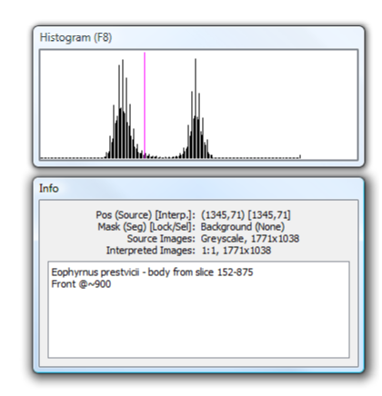

.. _histogram:

Histogram
=========

The *Histogram* panel shows the
`histogram <http://en.wikipedia.org/wiki/Image_histogram>`__ of the
working image for the selected segment of the current image (see Fig.
20, top). This can be restricted to a smaller area by selecting a region
with the lock/selection mode, and then ticking the *Histogram shows
selected* on the *Mode* menu.

	
    Figure 20. Histogram (top) and Info (bottom) panels