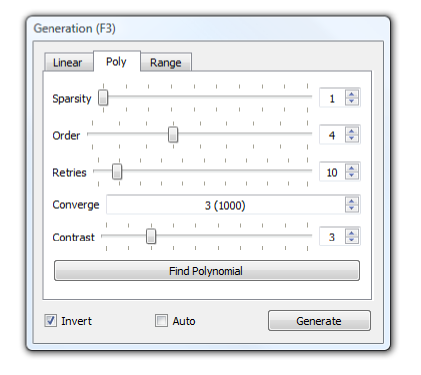

.. _polynomialgeneration:

Polynomial Generation
=====================

Concepts
--------

*Linear* generation is a relatively crude way of turning a colour image
into a monochrome working image, and while *Range* generation is an
effective alternative for monochrome datasets (e.g. from CT scanning),
both approaches potentially misses subtleties of colouration in
colour-based datasets (e.g. from serial grinding), where different
materials can be picked out with colour differences rather than simply
brightness level. *Polynomial* generation mode is a more sophisticated
approach to this generation-from-colour problem, which can in some
circumstances produce ‘better’ thresholds, which will need less manual
editing afterwards. It is however more complex both in concept and
practice, and it recommended only for advanced users.

Polynomial generation uses the concept of *training*; the user first
manually edits a region of the dataset to their satisfaction, so that
all pixels in this region (which can span multiple slices) are assigned
to their correct segments. SPIERSedit is then asked to create generation
rules (based on mathematical polynomial equations) which would work
replicate this manual editing work as effectively as possible (i.e.
would correctly predict the segment assignment in the sample for as high
a percentage of pixels as possible). Once created, these rules can be
applied using the *Generate* button to all selected slices (or with the
*Recalc* brush) in the same way as for *Linear* generation.

*Mathematical note: Polynomial mode generation rules are polynomials of
the form:*

v = k\ :sub:`1` + k\ :sub:`2`\ r + k\ :sub:`3`\ g + k\ :sub:`4`\ b +
k\ :sub:`5`\ r\ :sup:`2`\ + k\ :sub:`6`\ g\ :sup:`2` +
k\ :sub:`7`\ b\ :sup:`2` + … + k\ :sub:`(3n+1)`\ r\ :sup:`n` +
k\ :sub:`(3n+2)`\ g\ :sup:`n` + k\ :sub:`(3n+3)`\ b\ :sup:`n`

where v is the greyscale value, r, g, and b are the red, green and blue
values of the colour image, and n (the order of the polynomial) and
k\ :sub:`1` to k\ :sub:`(3n+3)` (constants) are the values that comprise
the rule.

The *Poly* tab of the *Generation* Panel provides controls for the
creation of polynomial rules; with this tab selected, the *Generation*
button (and the *Recalc* brush) will use polynomial mode generation
rules.

Polynomial mode can be used for multi-segment datasets, but both
Polynomial rule-creation and generation is performed on a per-segment
basis.

SPIERSedit uses a genetic algorithm to create polynomial rules; this
approach simulates Darwinian evolution to ‘breed’ effective rules. It
starts with a random rule (or the best rule from the last time the
genetic algorithm was run, if applicable) and determines what percentage
of the pixels in the supplied sample would have come out correctly had
that rule been used. It then makes a small random change to the rule,
and checks again. If the new rule performs better (is ‘fitter’) it is
retained, otherwise it is discarded. The process is repeated for many
‘generations’ until the rule reaches an optimal fitness and no further
improvements appear to be possible.

Creating a Sample
-----------------

*Polynomial* generation requires a sample of edited ‘correct’ pixels to
build its rules. The sample used is the pixels turned ‘blue’ in
Lock/Selection mode (see below) for all slices selected in the *Slice
Selection* panel; it can thus consist of as many or as few pixels on as
many slices as the user desires. SPIERSedit has no facility for storing
samples; whenever ‘Find Polynomial’ is clicked the current selection is
used, and any previous sample is discarded.

Poly Tab Controls
-----------------

The *Poly* tab on the *Generation* panel (see Fig. 14) provides controls
for the polynomial rule creation process.

	
    Figure 14. Poly tab of the Generation Panel.

*Sparsity:* Controls how many of the sample pixels are used in the
breeding process. A sparsity of 1 means every pixel is used, 2 means
every other pixel, 5 every fifth pixel etc. Use this to speed the
breeding process, although this might result in slightly less fit rules.

*Order*: Strictly speaking this is not part of the breeding process, but
like the other settings it should be set before breeding. It controls
the ‘order’ of the polynomial (*n* in the mathematical note above).
Normally you can leave this at the default value of 4. Increasing it
increases the time take to breed a solution, but can (in theory at
least) result in better rules. Changing this and then generating without
first creating breeding new rules with ‘\ *Find Polynomial*\ ’ can
result in strange behaviour!

*Retries*: The number of times the breeding process is run. Genetic
algorithms can become stuck in blind alleys, where the rule has stopped
improving, but is still far worse than it could be because a wrong
direction was taken early on. To get around this the breeding process is
run several times with different starting rules each time; the best
solution from all runs is then taken. The catch is that the time taken
for the genetic algorithm to run in proportional to the number of
retries used. You should normally use at least five retries, unless you
are refining an existing rule (see below). The default is 10.

*Converge*: The number of generations without any improvement before the
algorithm gives up trying to make a rule better. High values make for
slower breeding but (potentially at least) slightly better rules.

*Contrast*: This isn’t a setting for breeding but for generation. You
may find that a rule generates greyscale images with either too little
contrast (where most pixels are either just brighter or just darker than
the threshold level), or too much contrast (where most pixels are either
pure black or pure white). This doesn’t affect the threshold image, but
does affect the usefulness of the brightness brush – you need a
reasonable amount of contrast to play with. Changing the contrast
setting to compensate for this – check how much contrast you have by
generating and visually inspecting the working image by turning off
thresholding (untick *Threshold* on the *Mode* menu).

*Find Polynomial button*: Starts breeding with the current settings.
Progress is reported in a small dialog, which reports the fitness of the
current (‘Best’) rule as a percentage, representing the proportion of
pixels in the sample that the current rule predicted correctly (so high
is good); values of over 95% are normally attainable. The algorithm can
be left to run to completion, or can be stopped at any time with the
stop button. Whether the operation is complete or has been manually
stopped the best rule found will be used. Once completed or stopped, the
dialog should be closed with it’s ‘Close’ button.

Advice on polynomials
---------------------

Breeding can take a long while, particularly for large samples across
multiple images. The best way to speed it up is to perform a two-stage
breed. Firstly, set a large number of retries (say 30 or so), but choose
a low convergence (say 2000) and a high sparsity (how high depends on
the speed of the computer and the size of the sample – anything that
makes things go reasonably quickly). Perform a *Find Polynomial*
operation with these settings, which will try a lot of different rules
in a rough-and-ready way. From this you will end up with one good
candidate. Now set up a careful breed without any retries (set retries
to 1, sparsity to 1, and converge to 32000 or more) and perform a second
*Find Polynomial* operation. This second run of the algorithm will take
the best rule from the first run and give it as much chance to improve
as possible. Using this two-stage approach, high quality rules can
normally be generated in a few minutes at most.