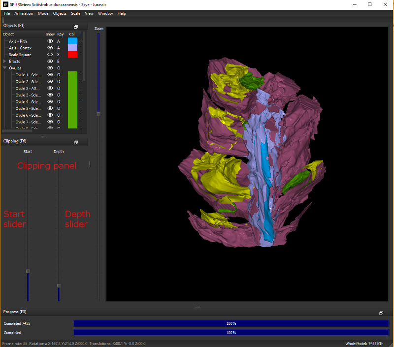

.. _clippingpanel:

Clipping panel
==============

SPIERSview provides a simple system for performing limited virtual
sectioning, using the *Clipping panel* (see Fig. 3). All models are
‘clipped’ front and back by two notional invisible planes, perpendicular
to the viewing direction – objects in front of the front plane or behind
the back plane are not shown. The front plane is by default very close
to the viewing position, and the futher plane a long way away. The
*Start slider* on the clipping panel controls how far from the viewer
the front plane is – moving the slider upwards moves the plane away from
the viewer; at some point it will be seen to intersect the model,
removing objects from the front. The depth slider controls how far
beyond the front plane the back plane is. Moving this slider downwards
decreases the depth of the visible region between the planes – bringing
it to very near the bottom (as in Fig. 3) produces a thin slice through
the specimen.

	
    Figure 3. Info and Clipping panels

Clipping is a view-only feature – it does not affect how models are
exported.