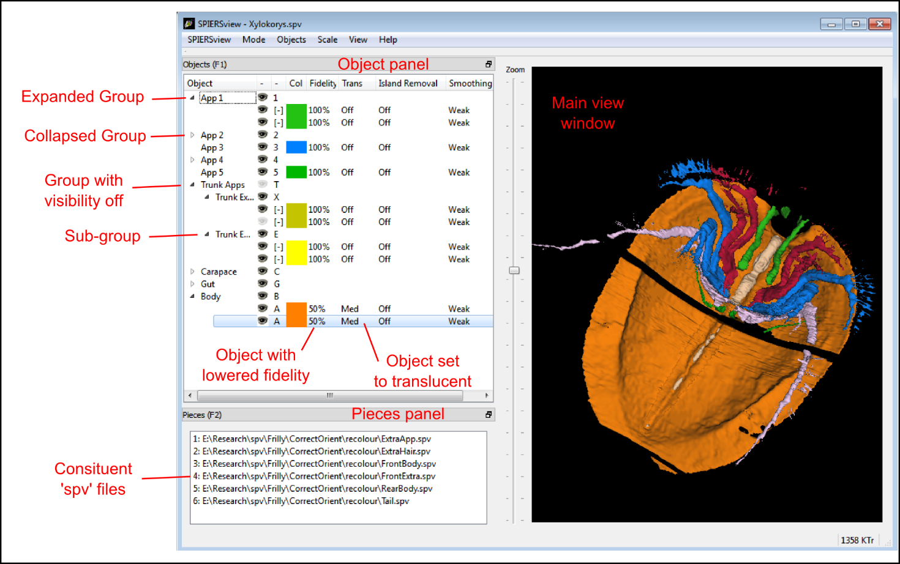

.. _advobjectproperties:

Advanced Object properties
==========================

Fidelity
----------

SPIERSview can reduce the number of triangles in an object (referred to
as its fidelity) using one of two algorithms (see below). Reducing
triangle-count enables objects to display effectively on lower powered
systems, and may also help when exporting geometries to other software.
Fidelity reduction is however computationally expensive, ‘lossy’
(resultant geometries will not be exactly the same as the original), and
may require a large amount of system memory to perform successfully. To
change fidelity select the objects to be affected, and use the ‘\ *Set
Fidelity’* command in the *Objects* menu to enter a new value – a
fidelity of 100% represents the original triangle count (no fidelity
reduction). Objects will then need to be resurfaced (see below).

By default fidelity-reduction uses a relatively fast and ‘safe’
algorithm that is normally only able to reduce fidelity by up to 50% -
settings lower than this will not always result in smaller models.
Alternatively, a ‘Quadric’ fidelity-reduction algorithm is available,
selected by ticking the so-named menu item in the Objects menu. This
alternative algorithm is slower and more memory hungry (it may fail and
crash for some very complex objects on systems with limited memory), but
normally produces better results, especially at low fidelities.

Fidelity reduction is not available in Finalised/VAXML mode.

Fidelity reduction is performed before Island Removal or Smoothing

Transparency
--------------

SPIERSview can display objects in a translucent form; transparency is by
default off, but can be set to one of four preset levels by selecting
object(s) and using the *Transparency* commands in the *Objects* menu or
their keyboard shortcuts (Ctrl-1 is ‘transparency off’, ctrl-2 through
ctrl-5 are increasingly high levels of translucency). A facility is also
provided, on the *Transparency* sub-menu of the *Objects* menu, to set a
custom transparency level (0 is opaque, 99, almost transparent).

Transparency is not easy to implement perfectly, and in all software the
method used is a trade-off between speed and ‘correctness’. SPIERSview
provides a relatively fast implementation that is normally sufficient,
but can in some cases produce unexpected results, especially when
viewing translucent objects through other translucent objects. If ‘true’
transparency is required for publication-quality images, export of the
model to another rendering package (e.g. a ray-tracer) is recommended.

Changes to transparency do *not* require objects to be resurfaced (see
below).

Shininess
-----------

As of version 2.20, SPIERSview renders objects using a ‘phong’ shading
model, which approximates highlights and reflections from objects. These
are visually appealing, and can assist in visualizing surface
morphology. The shininess of objects can be set to one of four preset
levels by selecting object(s) and using the *Shininess* sub-menu in the
*Objects* menu; levels are ‘Off’, ‘Less’, ‘Default’ and ‘Full’. If more
precise control is required, a custom shininess level can also be set
using the appropriate command in the *Shininess* sub-menu ; values range
from 0 (Matte, Off) to 100 (equivalent to ‘Full’).

Changes to shininess do *not* require objects to be resurfaced (see
below).

Island Removal
----------------

SPIERSview provides a filter to remove ‘islands’ from data – islands are
groups of triangles not connected with the main object, which often
represent noise. Island removal level is set using the commands of the
*Island removal* sub-menu on the *Objects* menu. It can either be off
(the default), ‘all’ (where all islands of triangles not connected to
the largest object are removed), or one of four intermediate settings
where increasingly large islands are removed. A custom island-removal
level can also be specified using the appropriate command on the *Island
removal* sub-menu; here the user specifies a minimum size (in triangles)
for islands; all smaller are removed. Note that it is possible to remove
all islands, including the largest, by specifying too high a threshold.

Island removal can be slow and memory hungry; it may fail for some very
complex objects on systems with limited memory. Note that the remove
‘all’ option is usually faster and less demanding on the system than the
intermediate options. Objects will need to be resurfaced (see below)
after changes are made to Island Removal settings.

Island removal is not available in Finalised/VAXML mode.

Island removal is performed after fidelity reduction but before
smoothing.

Smoothing
-----------

Surfaces created by SPIERSview as isosurface from slice-based
(tomographic) data may be rather ‘blocky’. A smoothing filter may be
applied to smooth out blockiness artefacts and other fine-scale noise,
providing what is hopefully a better approximation to an original
biological surface; excessive smoothing can however modify the geometry
in unhelpful ways, and hence it should always be used with care.
Smoothing is by default off for all objects, but the degree applied is
set using the commands of the *Smoothing* sub-menu on the *Objects*
menu. Seven levels, from ‘off’ to ‘strongest’ are available; the
stronger the smoothing the slower the process will be. A custom
smoothing level can also be specified using the appropriate command on
the *Smoothing* sub-menu; here the user specifies the number of
iterations of the smoothing algorithm; the equivalent to ‘strongest’ is
100, but higher values can be specified if desired.

Smoothing is not available in Finalised/VAXML mode.

Smoothing is performed after both fidelity reduction and island removal.

Resurfacing
-------------

Changes to smoothing, island removal or fidelity can be time consuming,
and are hence not applied immediately. To manually apply changes and
force recalculation of objects with new settings, use the *Resurface
Now* command on the *View* menu (F5). This approach is used to save
time; resurfacing can be slow, and typically a user will want to change
several settings before triggering a resurface. Alternatively, an
*Auto-Resurface* mode is provided (*Mode* Menu, Shift-F5), turned off by
default; with this mode enabled resurfacing is triggered after every
change to smoothing, island removal or fidelity.

	
    Figure 2. Objects and Pieces panels.