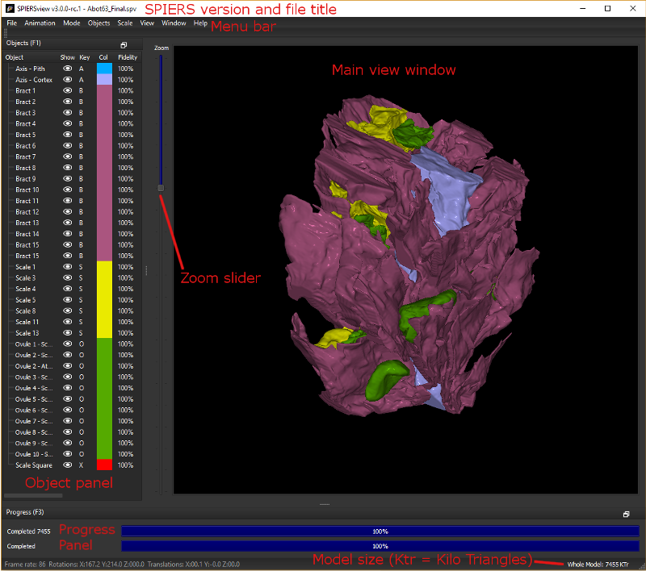
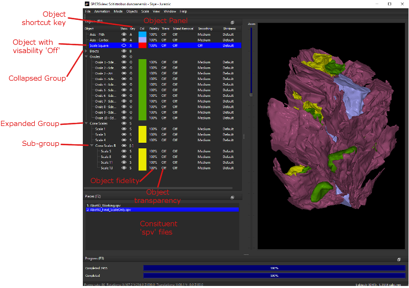

.. SPIERSview documentation master file, created by
   sphinx-quickstart on Thu Oct  5 14:07:27 2018.
   You can adapt this file completely to your liking, but it should at least
   contain the root `toctree` directive.

Welcome to SPIERSview's User Manual
====================================

[S]erial [P]alaeontological [I]mage [E]diting and [R]endering [S]ystem: Three-dimensional interactive viewer

Main Coding: Mark Sutton
Additional Coding: Russell Garwood, Alan R.T. Spencer
Documentation: Mark Sutton, Russell Garwood, Alan R.T. Spencer

SPIERSalign is a stand-alone program which enables the user to align (or register) and crop a sequence of images (a tomographic dataset) prior to editing and/or reconstruction with SPIERSedit.

.. figure:: _static/palaeoware_logo_square.png
    :align: center

t:@palaeoware

w:https://github.com/palaeoware.

Relevant references
-------------------

Table of Contents
=================

Introduction and File Formats
=============================

SPIERSview is a stand-alone program for viewing and manipulating
three-dimensional models. It understands five different file formats,
the first four of which it can also output:

*1. Compact SPIERSview files (.spv file extension).* These are very
small in size and intended as a practical way of distributing models
over the internet; they can, however, take a long while to load as the
software must compute isosurfaces for all objects. SPIERSedit generates
files in this format.

*2. Presurfaced SPIERSview files (also .spv file extension).*
Presurfaced .spv files allow SPIERSview to skip the computation of
isosurfaces on loading; hence they normally load substantially quicker.
They are typically around an order of magnitude larger than compact
files, however, and are thus impractical for transferring over the
internet. Presurfaced files are generated by SPIERSview itself.

*3. Finalised SPIERSview files (.spvf file extension).* Finalised files
load very quickly, but are even larger than presurfaced files. They are
‘locked’; when a user loads a finalised file, SPIERSview enters a
stripped-down view-only mode (*finalised/VAXML mode*), in which the
model cannot be altered. Use finalised files to produce ‘finished’
versions of models for viewing by other workers, or as teaching tools.

4. *VAXML datasets* (*.vaxml extension*). VAXML (Virtual Anatomy XML) is
intended as a simple interchange format for virtual anatomy
(palaeontological or biogical) datasets. VAXML datasets use one or more
STL files (either binary or ascii) to define the geometry of objects
that comprise the dataset, together with one VAXML file that provides
data on the dataset as a whole, and specifies how the STL files are to
be put together. SPIERSview can generate VAXML/STL datasets from compact
or presurfaced SPIERSview files (.spv extension). Note that SPIERSview
loads VAXML datasets in the same stripped-down view-only mode
(*finalised/VAXML* mode) as it uses for finalised SPIERSview files
(.spvf); the latter are in fact little more than combined and compressed
combinations of a VAXML file and STL object geometries.

*5. SPIERSview metafiles (.sp2 extension).* These are a legacy mechanism
from earlier versions of SPIERSview for combining .spv files together;
while SPIERSview can still read them, no current software generates
them.

System requirements and triangle count
======================================

SPIERSview has no minimum requirements as such, and will run simple
models on most systems; it has however not been tested on versions of
Windows older than Windows XP. Performance will benefit from high
processor speed, a large amount of system RAM, and a fast graphics card
with a large amount of onboard RAM. A 64-bit version is available; the
32-bit version is restricted to using 2Gb of RAM, but the 64-bit version
can use all available RAM, and is hence recommended for 64-bit systems.

SPIERSview measures the complexity of models in thousands of triangles
(KTr). At the time of writing, typical 64-bit workstation systems with
4Gb of RAM can comfortably cope with models of up to 25-30,000 KTr,
while basic 32-bit desktop and laptop systems may struggle with models
of over 3,000 KTr. Difficulty rendering a model can manifest itself
through slow responses, while the largest models will result in an error
message or crash on loading. Triangle count reduction in SPIERSedit
exports is possible by avoiding ‘speckly’ data (see SPIERSedit manual),
rendering restricted numbers of slices, and the use of downsampling or
‘binning’. SPIERSview itself can simplify models using one of two
‘fidelity reduction’ algorithms (see below); using these it may be
possible to use a powerful system to convert a difficult model to a
lower triangle count model that can be handled by lower powered systems.

Starting SPIERSview
===================

Opening a file
--------------

SPIERSview uses a single-document model – it only views a single file at
any time. To view another file simply open multiple copies of the
program, and to close a file you close the program.

SPIERSview can be launched in one of two ways:

1) Launching the SPIERSview program directly: this will bring up a
dialog allowing you to select the file you want to load. If you cancel
the load dialog, the program will close.

2) (Recommended) Double-clicking a ‘.spv’, ‘.spvf’, ‘.vaxml’ or ‘.sp2’
file will launch SPIERSview to view these data.

Initial processing
------------------

When launched, SPIERSview has to process the data to generate viewable
objects, first calculating ‘isosurfaces’ (3D triangle-meshes) from
slice-based data using the Marching Cubes algorithm
(http://en.wikipedia.org/wiki/Marching\_cubes), and then converting
these into a viewable format. This process may take anything from a
second or two to several minutes, and depends on the type of file opened
(see above) and the complexity of the objects. Note that for VAXML
files, these tasks may include downloading STL data from a remote
server, which may be slow. Progress bars show the completed percentage
of this work; the top bar represents overall progress, and the lower bar
the progress of each subtask. Note that the user can begin interacting
with the model once the first object has been loading; subsequent
objects will appear as they become available.

Basic viewing and manipulation
==============================

The default SPIERSview screen setup has the main view window (black) on
the right, the objects panel on the left, and progress panel at the
bottom (see Fig. 1). The Main view window and the Zoom slider (see
below) are permanently visible – the panels can be hidden, resized,
repositioned or set to ‘float’ as the user desires. In addition to the
two initially visible panels there are three more, the clipping panel,
Info panel and pieces panel (discussed later). Panels are switched on
and off using the view menu, or the keyboard shortcuts indicated in
their title bars (F1, F2, F3, F4 and F6).

	
    Figure 1. Default anatomy of a SPIERSview window

The status bar at the bottom gives total model size in KTr (and scale if
the scale ball is visible). There is also a permanently visible to
control model scale.

When viewing models in SPIERSview finalised format (.spvf) or VAXML
format (.vaxml), the interface is simplified; many menu options will not
appear, and the pieces panel is not available.

Moving, rotating and zooming
----------------------------

The model can be moved by dragging using the left mouse button, and
rotated in three dimensions by dragging with the right mouse button. You
can also rotate around the z-axis (the viewing direction) using the left
and right arrow keys, or by holding the shift-key down while dragging
with the right mouse button. It is also possible to ‘lock’ the viewer
into rotate mode by ticking the *rotate lock* command (Ctrl-R) on the
Mode menu (this is primarily useful on single-button systems, on
two-button systems both left and right drag rotate the model).

The *auto spin* command (Ctrl-U) on the Mode menu sets the model
spinning around the y-axis (up/down on the screen) until the command is
selected a second time.

The *Zoom slider* (see Fig. 1) is used to zoom the view; the Page Up and
Page Down keys also perform the same function.

Object visibility
-----------------

SPIERSview models consist of a number of *objects* and *groups* of
objects (see below) which are listed in the *object panel* on the left
of the screen (Fig. 1). Each object is normally given a different
colour, and each object or group can be independently turned on or off
(hidden from view), enabling the user to perform ‘virtual dissections’.
This can be done by double-clicking the ‘eye’ icon for each object in
the object panel (see Fig. 1), or by using the keyboard key assigned to
the object (the single character A-Z or 0-9 visible to the right of the
eye icon). Objects are not required to have a key assigned, in which
case they can only have their visibility toggled with the ‘eye’ icon. If
a group is hidden, then all objects or groups within it, irrespective of
their visibility setting, are not visible.

The objects menu has *Show All* and *Hide All* commands which can be
used to set the visibility of all objects either on or off. An *Invert
Show* command also exists, which hides all currently shown objects, and
vice versa.

Note that transparency (see below) can be used as an alternative to
simply hiding objects in some situations.

Stereoscopic 3D viewing
-----------------------

SPIERSview can run in several 3D display modes (top four options in the
Mode menu). These are:

*No Stereo:* Normal display without any form of stereoscopic 3D. This is
the default.

*Anaglyph Stereo (Ctrl-A)*: Anaglyph stereo mode splits the left and
right eye images using red (left) and cyan (right) filters, and allows
3D viewing using red/cyan or red/green glasses; the former will work
better, but the latter are normally adequate. This is intended as a
cheap and effective means of viewing 3D models, but (unlike *Split
Stereo* or *QuadBuffer Stereo* modes) does not fully preserve colour
information. Anaglyph stereo viewing may also be hampered if the model
contains strong colours; the *Mute Colours* command (Ctrl-M) on the Mode
menu can help in these cases, as this reduces colour saturation.

*Split Stereo (Ctrl-S)*: This mode splits the Main view window in two,
displaying the left and right eye images in the left and right halves.
Direct viewing in this mode requires viewer to be able to separately
focus on each image (freeviewing). Screen captures (see below) in this
mode can be used to generate printed stereo-pairs for viewing with a
magnifying stereoscope.

*QuadBuffer Stereo*: This mode sends the left and right eye images
separately to the OpenGL rendering system where they can be interpreted
by dedicated 3D display hardware. Most 3D display systems can handle
OpenGl QuadBuffer input, and hence SPIERSview should be able to use this
mode to produce stereoscopic 3D output using most 3D screens and
projectors. Please note that no guarantee of success for any particular
hardware can be provided!

The user may find that the default ‘medium’ stereo-separation (the
strength of the stereoscopic effect) is too high or too low in some
situations. Stereo-separation can be set to one of five preset
strengths, accessed through the View menu or using the keyboard
shortcuts Alt+1 (very low) through Alt+5 (very high).

Anti-aliasing
=============

SPIERSview supports hardware anti-aliasing (jagged edge reduction;
http://en.wikipedia.org/wiki/Anti-aliasing) through OpenGL; not all
hardware will support this facility, and on some systems anti-aliasing
will not work in QuadBuffer Stereo mode. Anti-aliasing is off by
default, but can be set to x2, x4, x8 or x16 using the view menu. Higher
anti-aliasing settings improve image quality by smoothing jagged edges,
but reduce performance and may use more memory. Consider turning
anti-aliasing on before performing screen captures for maximum image
quality. Changing the anti-aliasing mode forces a full resurfacing of
all objects; for compact or presurfaced SPIERSview files (.spv format)
this may take a considerable amount of time.

Object Panel
============

Groups
------

Objects can be combined into groups; groups can also exist as subgroups
within other groups (see Fig. 2), enabling the user to build up a
hierarchy of objects to describe an anatomy. For instance, an arthropod
model might include a group called ‘appendages’ – this in turn might
include a subgroup called ‘cephalic’ appendages, which might in turn
include a ‘mandibles’ group, consisting of a left and right mandible.
Object grouping not only provides a convenient way to explain
relationships, but also allows visiblity to be controlled for sets of
objects – in the above example for instance a key could be assigned to
the appendages group, allowing the entire appendage set to be quickly
hidden or shown.

Groups are indicated in the panel in a standard way (Fig. 2); they can
be expanded or collapsed to show their contents. Groups only have two
properties; their shortcut key, and their visibility.

Groups are created by selecting a number of objects and using the
*Group* command (Ctrl-G) on the *Objects* menu. You should normally
rename groups after creating them. Groups are removed by selecting the
group and using the *Ungroup* command (Ctrl-G) on the *Objects* menu.
Selecting objects and using the *Ungroup* command will remove them from
the group they are currently in. You can also move an object into an
existing group with the *Move To Group* command (Ctrl-E) on the
*Objects* menu.

Turning visibility off for a group does not alter the individual
visibiity settings of contained objects (or groups), but overrides them
so they are all hidden. In Figure 2 for instance, all objects in the
‘Trunk Apps’ group are currently invisible (whatever their individual
visibility setting), as this group is set to invisible. Once visibililty
is turned on again for the parent group, the individual visibility
settings of its contained objects (or groups) are used again.

Position in object panel
------------------------

Objects (and groups) can be moved up and down the list in the objects
panel using the *Move Up* and *Move Down* commands (F12 and F11
respectively) on the *Objects* menu. These changes affect only the
panel, and have no effect on the way the model is displayed.

Object properties
-----------------

Objects listed in the object panel have seven properties detailed in
columns to the right of the name (see Fig. 2; not all columns are
visible at default panel size). The name (1:sup:`st` column), visibility
(2:sup:`nd` column), shortcut key (3:sup:`rd` column) and display colour
(4:sup:`th` column) are all modified simply by double-clicking. The
properties in the right hand four columns (Fidelity, Transparency,
Island Reduction and Smoothing) are set using commands on the object
menu. Of these, only transparency is available in *Finalised/VAXML* mode

Advanced Object properties
==========================

*Fidelity*
----------

SPIERSview can reduce the number of triangles in an object (referred to
as its fidelity) using one of two algorithms (see below). Reducing
triangle-count enables objects to display effectively on lower-powered
systems, and may also help when exporting geometries to other software.
Fidelity reduction is, however, computationally expensive, ‘lossy’
(resultant geometries will not be exactly the same as the original), and
may require a large amount of system memory to perform successfully. To
change fidelity select the objects to be affected, and use the ‘\ *Set
Fidelity’* command in the *Objects* menu to enter a new value – a
fidelity of 100% represents the original triangle count (no fidelity
reduction). Objects will then need to be resurfaced (see below).

By default fidelity-reduction uses a relatively fast and ‘safe’
algorithm that is normally only able to reduce fidelity by up to 50% -
settings lower than this will not always result in smaller models.
Alternatively, a ‘Quadric’ fidelity-reduction algorithm is available,
selected by ticking the so-named menu item in the Objects menu. This
alternative algorithm is slower and more memory hungry (it may fail and
crash for some very complex objects on systems with limited memory), but
normally produces better results, especially at low fidelities.

Fidelity reduction is not available in Finalised/VAXML mode.

Fidelity reduction is performed before Island Removal or Smoothing

*Transparency*
--------------

SPIERSview can display objects in a translucent form; transparency is by
default off, but can be set to one of four preset levels by selecting
object(s) and using the *Transparency* commands in the *Objects* menu or
their keyboard shortcuts (Ctrl-1 is ‘transparency off’, ctrl-2 through
ctrl-5 are increasingly high levels of translucency).

Changes to transparency do *not* require objects to be resurfaced (see
below).

*Island Removal*
----------------

SPIERSview provides a filter to remove ‘islands’ from data – islands are
groups of triangles not connected with the main object, which often
represent noise. Island removal level is set using the *Island removal*
commands on the Objects menu. It can either be off (the default), ‘all’
(where all islands of triangles not connected to the largest object are
removed), or one of four intermediate settings where increasingly large
islands are removed. Island removal can be slow and memory hungry; it
may fail for some very complex objects on systems with limited memory.
Note that the remove ‘all’ option is usually faster and less demanding
on the system than the intermediate options. Objects will need to be
resurfaced (see below) after changes are made to Island Removal settings
for these to appear.

Island removal is performed after fidelity reduction but before
smoothing.

*Smoothing*
-----------

Isosurfaces created by SPIERSview from slice-based (tomographic) data
may be rather ‘blocky’. A smoothing filter can be applied to smooth out
blockiness artefacts and other fine-scale noise, providing what is
hopefully a better approximation to original biological surfaces;
excessive smoothing can, however, modify the geometry in unhelpful ways,
and hence it should always be used with care. Smoothing is off for all
objects by default. The degree applied is set using the *Smoothing*
commands on the *Objects* menu. Seven levels, from ‘off’ to ‘strongest’
are available; the stronger the smoothing the slower the process will
be.

Smoothing is performed after both fidelity reduction and island removal.

*Resurfacing*
-------------

Changes to smoothing, island removal or fidelity can be time consuming,
and are hence not applied immediately. To manually apply changes and
force recalculation of objects with new settings, use the *Resurface
Now* command on the *View* menu (F5). This approach is used to save
time; resurfacing can be slow, and typically a user will want to change
several settings before triggering a resurface. Alternatively, an
*Auto-Resurface* mode is provided (*Mode* Menu, Shift-F5), turned off by
default; with this mode enabled resurfacing is triggered after every
change to smoothing, island removal or fidelity.

	
    Figure 2. Objects and Pieces panels.

Manipulating objects independently
==================================

Normally SPIERSview keeps objects in the same relative position.
Occasionally, there certain objects need to be shifted, rotated and
scaled independently. This facility, which is turned on or off using the
*Reposition Selected* command under the *Mode* menu, is especially
useful in conjunction with multi-piece datasets (see below).

With this mode selected, all rotates and shifts made using the mouse or
menu commands affect only the objects currently selected in the object
panel, as do any scale changes (see below).

*Reposition Selected* mode is not available when SPIERSview is running
in *Finalised/VAXML* mode.

Multi-piece datasets
====================

SPIERSview can combine two or more ‘.spv’ format files (both compact and
presurfaces varieties) into a single multi-piece model; this facility is
useful for combining parts of an object initially reconstructed as
multiple SPIERSedit datasets (e.g. part and counterpart of a fossil).
Each ‘.spv’ file incorporated is known as a *piece*. The *Pieces panel*
(see Fig. 2) shows all the pieces making up the currently open file – if
no extra pieces have been imported, there will be only one such piece.

Items in the pieces panel by default have the filename imported – they
can be renamed (by double clicking) to provide a more helpful name.

New pieces can be imported into SPIERSview using the *Import piece*
command on the *SPIERSview* menu. These must be ‘.spv’ files, and must
be files saved by SPIERSview itself – files exported by SPIERSedit
cannot be imported directly (to get around this restriction simply load
any such file into SPIERSview, then save it again). Pieces can be
removed by selecting them in the Pieces panel and using the *Remove
Piece* command on the *SPIERSview* menu. They can also be replaced with
new versions using the *Replace Piece* command on the *SPIERSview* menu;
this preserves any re-positioning, grouping of objects, etc performed on
the piece being replaced, so is useful to re-import updated files from a
SPIERSedit dataset.

Objects from *all* pieces are shown in the objects panel. On import, the
objects from a new piece will appear at the bottom, but they can be
grouped with objects from other pieces, and/or moved up and down the
list at will.

When new pieces are imported they will not typically be correctly
positioned relative to one-another. To manually reposition, the user
should use the *Reposition Selected* mode described above. To assist
with this, selecting a piece in the pieces panel automatically selects
all the objects in the piece in the Object panel, ensuring that the
correct objects are moved.

Legacy ‘.sp2’ files (see above) are opened by SPIERSview as multi-piece
files.

Clipping panel
==============

SPIERSview provides a simple system for performing limited virtual
sectioning, using the *Clipping panel* (see Fig. 3). All models are
‘clipped’ front and back by two notional invisible planes, perpendicular
to the viewing direction – objects in front of the front plane or behind
the back plane are not shown. The front plane is by default very close
to the viewing position, and the rear plane a long way away. The *Start
slider* on the clipping panel controls how far from the viewer the front
plane is – moving the slider upwards moves the plane away from the
viewer; at some point it will be seen to intersect the model, removing
anatomy from the front. The depth slider controls how far beyond the
front plane the back plane is. Moving this slider downwards decreases
the depth of the visible region between the planes – bringing it to very
near the bottom (as in Fig. 3) produces a thin slice through the
specimen. The zoom slider works in the same manner as a non-clipped
model.

.. figure:: _static/figure_3.png
    :align: center
	
    Figure 3. Info and Clipping panels
	
	
Clipping is a view-only feature – it does not affect how models are
exported.

Info panel
==========

SPIERSview allows models to be supplemented by textual metadata, viewed
and input through the *Info panel* (see Fig. 3). This data is broken
into the following headings: *Title* (A title for the model – this will
appear in the title bar of the SPIERSview window)\ *, Classification,
Authors* (intended as authors of this model)\ *, References* (either to
papers or URLs to web resources)\ *, Specimen* (Specimen numbers
etc)\ *, Provenance* (where specimen is from, including geological age
if applicable) and *Comments* (for miscellaneous notes not falling into
above categories). Each of these categories can have none, one or more
textual notes contained within it, the exception being Title which can
have at most one. Classification also differs in that items consist of
two parts, a rank (e.g. Genus) and a name (e.g. *Homo*), which are input
separately.

The upper portion of the Info panel is known as the *Info items* window.
It lists these categories, and any that contain data, these are listed
subsidiary to the category as items (you will need to expand the
category to view them). To view the data in a category simply select it:
all items will then be displayed in order in the lower *Info detail*
window of the panel.

Items can be added by double-clicking on the category heading in the
*Info items* window, deleted by selecting the item in *Info items* then
using the delete key, or edited by double-clicking on the item itself.
Attempting to delete a category will delete all items within it, but
will not remove the category heading.

Saving and exporting
====================

SPIERSview compact and presurfaced files (.spv)
-----------------------------------------------

When viewing an ‘spv’ format file, the *Save Changes* command (Ctrl-V)
on the *SPIERSview* menu will save the file in whatever format (compact
or presurfaced) it was opened in. SPIERSview will also ask if you want
to save changes before exiting; this also will use the format the file
was opened in. *Save Compact As...* and *Save Presurfaced As...*
commands are also provided in the *SPIERSview* menu– these force the
file to save in whichever of these two formats you specify, and can
hence be used to convert between the two.

SPIERSview finalised files (.spvf)
----------------------------------

The *Export Finalised...* command on the *SPIERSview* menu saves a copy
of the current ‘.spv’ file in Finalised format (see above), for
view-only rapid loading. As the finalised format is internally
implemented using VAXML, a few restrictions apply and are checked at
save-time. The most significant of these is that all groups must have
unique names; if this is not true you will receive a warning, and the
file will not be written.

If the *Export Hidden Objects* item on the *SPIERSview* menu is ticked,
all objects are exported. If it is not ticked, the visibility of each
object is used to determine whether or not it is exported. Note that
this is simply the presence of absence of the ‘eye’ icon next to the
object in the Objects panel; an object might be set to visible (and
hence be exported) but not appear onscreen in SPIERSview because the
group it belongs to is hidden.

Groups are always exported, whether hidden or not.

VAXML/STL datasets
------------------

The *Export VAXML/STL...* command on the *SPIERSview* menu exports the
current ‘.spv’ file as a VAXML file, plus associated STL files. One STL
file is created per object, and these are placed in a subdirectory
called <filename>\_stl where <filename> is the supplied name for the
VAXML file. There is no option to export STL files without also creating
a VAXML file (although the latter can of course be manually deleted if
it is not required).

The *Export Hidden Objects* item on the *SPIERSview* menu works in the
same way as for SPIERSview finalised files.

DXF files
---------

The *Export DXF...* command on the *SPIERSview* menu exports the current
‘.spv’ file as a DXF triangle mesh. Objects are exported with their
correct names, but neither groups nor colours are preserved.

The *Export Hidden Objects* item on the *SPIERSview* menu works in the
same way as for SPIERSview finalised files.

Screen Capture
--------------

The *Screen Capture...* command on the *SPIERSview* menu exports the
current Main view windows as either a JPEG (.jpg), Windows Bitmap
(.bmp), Portable Network Graphic (.png) or Tagged Image File Format
(.tiff) file. The exact image visible (at the resolution visible) is
used – for best quality remove all panels and maximise the SPIERSview
window to obtain a large view window, and use Anti-aliasing (see above).

Scale 
======

Scale Ball System
-----------------

Visualising scale can be difficult on perspective-based 3D rendering
systems, as object scale decreases with distance from the viewing
position. SPIERSview uses the concept of a ‘scale ball’ to provide a
simple yet practical measurement / scale system. A ‘scale ball’ is
simply a sphere of known diameter hovering in space; a sphere is used to
ensure that the measurement is the same in all directions. By default,
SPIERSview’s scale ball stays in the middle of the screen; the object
under study can then be moved so that it intersects the ball, allowing
measurement.

The scale ball is shown or hidden using the *Show Scale Ball* command on
the *Scale* menu. Menu commands exist here also to set the ball to any
desired size (in mm) and to change its colour. If the user prefers to
move the scale ball rather than (or as well as) the model, the
*Reposition Scale Ball* command on the *Scale* menu can be used. With
this option ticked, mouse movements move the scale ball rather than the
model, the *Increase* *Size* and *Decrease Size* menu commands (see
below) affect the ball rather than the model, and the *Rescale By...*
menu command can also be used to rescale the ball by a certain
percentage. Use the *Reset Ball to Centre* menu command to reposition
the ball at the centre of the screen.

For files imported from SPIERSedit the internal scale should
automatically be correct, assuming the pixels / mm and slices / mm
values were set correctly at export time. If, however, the scale is not
correct, the entire model should be rescaled (see below) to match the
scale ball.

Rescaling objects
-----------------

The *Scale* menu has four commands that can be used to change the scale
of either the whole model (relative to the scale ball) or, if
*Reposition Selected* is ticked in the *Mode* menu, individual objects
(relative to each other and the scale ball). These commands are
*Increase* *Size* (+), *Decrease Size* (-), *Rescale By...*, and *Reset
Size*. The first two increase or decrease the size by a small increment.
*Rescale By...* allows resizes of arbitrary amounts, input as a decimal
factor (e.g. 0.5 is half size, 2.5 is 2 and a half times bigger, etc).
Reset size undoes any scale changes.

Update system
=============

SPIERSview incorporates an auto-updating system (as do the other two
SPIERS applications). If connected to the internet, it will check for
updates every time it is run. If it finds an update it will give you the
option of downloading and installing it. Agreeing to this will close
SPIERSview once the updater has been downloaded.

Appendix – VTK Usage
====================

Introduction
------------

VTK (the Visualisation Toolkit; http://www.vtk.org/) is a an
open-source, freely available software system for 3D computer graphics,
image processing and visualisation. SPIERSview makes use of VTK version
5.4 for some data-processing purposes (although not for visualisation,
which uses custom code to increase speed and memory efficiency). Certain
VTK classes used are documented here, where knowing details of
algorithms used may help a user understand exactly what SPIERSview is
doing with their data. Interested users are referred to the VTK
documentation to interpret the notes below.

Fidelity Reduction
------------------

SPIERSview default ‘fast and safe’ fidelity reduction uses the
*vtkDecimatePro* filter. *AccumulateError* is set to ‘off’,
*PreserveTopology* is set to on; no other settings are changed from
defaults.

SPIERSview ‘Quadric’ fidelity reduction uses the *vtkQuadricDecimation*
filter. No settings are changed from defaults.

Island Removal
--------------

Island removal uses the *vtkPolyDataConnectivityFilter* class.
*ColorRegions* is set to off; no other settings are changed from
defaults. ‘All’ mode uses *SetExtractionModeToLargestRegion*; otherwise
the filter is run in *SetExtractionModeToAllRegions* mode. Tiny, Small,
Medium and Large settings remove regions of up to 20, 100, 600 and 4000
triangles in size respectively.

Smoothing
---------

Smoothing uses multiple passes of the *vtkWindowedSincPolyDataFilter*
filter. *FeatureEdgeSmoothing*, *BoundarySmoothing*,
*GenerateErrorScalars* and *GenerateErrorVectors* are set to off, and
PassBand is set to 0.05. Very Weak, Weak, Medium, Strongish, Strong, and
Strongest settings use 5, 10, 20, 40, 60, and 100 iterations
respectively.

STL reader
----------

SPIERSview uses the *vtkSTLreader* class to import STL triangle meshes
during VAXML import; its restrictions and capabilities are thus those of
this VTK class.
