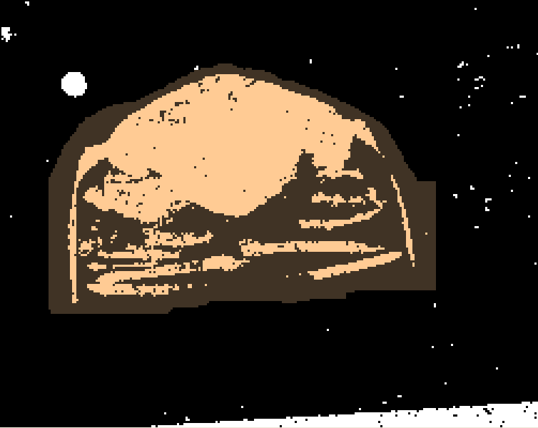
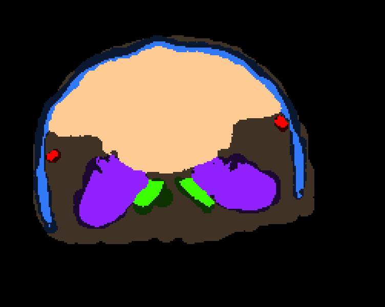
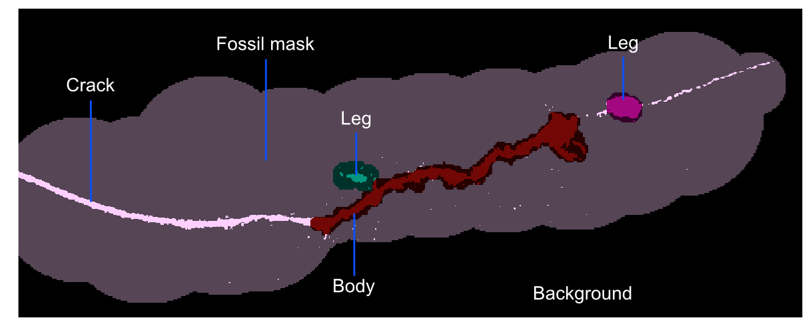
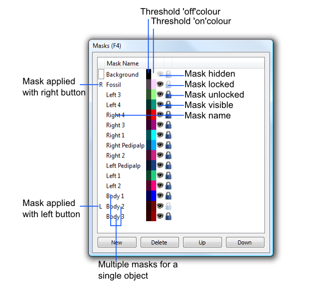

.. _masks:

Masks
=====

Concepts
--------

The SPIERSedit mask system allows the user to colour-code
different parts of the model. The two most common reasons to do this
are:

*Defining a region of interest*. While it is possible to manually delete
all undesired pixels in the background/matrix in each slice, the mask
system provides a quicker way to separate off the part of the image with
‘object’ in it from the rest. In Figure 7, a ‘fossil’ mask (light brown)
has been used to indicate the region of interest prior to any editing
work. The remaining background (still in the black/white colour of the
default mask) can then be hidden and excluded from visualisation with a
few clicks. A similar approach can be used to identify unwanted
structures such as cracks, and exclude them from visualisation.

	
    Figure 7. Mask as region of interest.

*Splitting a model into sub-units*: The most important
application for masks is to split the model into several separately
coloured units (e.g. split an arthropod fossil into carapace, appendages
and trunk). This enables colour-coding for clarity in the final
three-dimensional model, and also allows the user to perform ‘virtual
dissections’ by interactively hiding/unhiding these units in SPIERSview.
In Figure 8, a ‘body’ mask (light brown) has been applied prior to
editing (as above), and the background mask hidden from view. After
editing, further masks were applied to reassign some parts of ‘body’ to
other structures - a carapace mask (blue), and three different appendage
masks (purple, red and green) are visible.

	
    Figure 8. Masks used to identify structures.

Masks are only visible in *Mask* mode; however, if the *Always Show
Masks* option in the *Mode* menu is turned on, you will see masks (in a
washed-out form) in all other modes (except Lock/selection).

Note that masking affects both ‘on’ and ‘off’ pixels – a light version
of the colour is used for ‘on’, and a dark one for ‘off’. Only the ‘on’
pixels will appear in the final model of course, but the colour-coding
of ‘off’ regions is there to remind you of the mask that pixels
subsequently turned on here will be assigned to. Note that the
mask-boundaries in empty regions of the examples above are rough and
ready - this doesn’t matter, as there are no ‘on’ pixels here to appear
in any reconstruction. Those in 'on' regions (such as the inside of the
carapace, above) will be rendered as object boundaries, so more care is
required.

*Colour:* Mask colour only affects the colour masks appear in
SPIERSedit; while this colour is also used to provide a default colour
for output objects when they are created, these can be set
independently, and there is no requirement for SPIERSedit mask colours
to be those used for objects in SPIERSview; mask colours instead should
be chosen so that the user can easily distinguish masks which abut each
other when editing. Dark ‘on’ colours should normally be avoided.

*Visibility*: Masks can be visible or hidden. Hidden masks are still
visible in the threshold image as their ‘off’ colour, but no ‘on’ pixels
are shown. This only affects viewing of images in SPIERSedit; hidden
masks behave just like visible ones for export to SPIERSview. Hiding
masks only affects program behaviour if the *Hidden masks locked for
generation* option in the *Masks* menu is ticked; as expected this
option restricts all generation actions performed from the *Generate*
panel to visible masks. This allows different generation rules to be
applied for different regions of interest – often useful if there are
preservational differences between different structures. Note that the
recalc mode brush still affects hidden masks even with this option
ticked.

*Locking*: Masks can be locked or unlocked. A locked mask cannot be
overwritten by another mask, either with the mask brush, mask copy
commands, or through mask from curve operations (see below). There are
many uses for this facility, the most important being the locking of a
‘completed’ mask to avoid accidental changes to it.

Applying masks
--------------

Masks are applied by using the brush in *Mask* mode. The left and right
mouse buttons can be set to apply different masks; these are chosen from
the L and R mask dropdowns in the *Main Toolbox* panel, or alternatively
by left or right clicking in the left-hand column of the *Masks* panel.
In this column the R indicates the right mouse button mask and the L
indicates the left mouse button mask; if these coincide a ‘B’ (for both)
is displayed. Note additionally that selecting a mask in the *Masks*
panel automatically chooses it as the left-mouse mask.

Masks can also be applied using the *Masks from Curves* and *Copy*
commands (see below); these provide mechanisms for rapidly masking large
numbers of slices.

Advice on use of masks
----------------------

*Masking procedure:* When masking a dataset it is normally best to begin
masking an isolated part, such as a limb. Find such a structure, and
adjust the brush size, create and select a mask, and apply it using the
brush to create a coloured zone around a structure to encompass all its
boundaries (see Fig. 9). Moving forward or backward through the dataset
a slice at a time (most conveniently using the shortcut keys for
movement) allows this process to be repeated and structures followed
throughout the dataset. It is normally easier to create one mask at a
time and apply it to all required slices, rather than create all masks
at once and apply them all, slice by slice.

	
    Figure 9. Masking example.

Here a rough ‘Fossil’ mask has been used to
pick out a region of interest, facilitating initial inspection of data
and removing much of the background (hidden). Three subsequent masks
(two legs and a body) have subsequently been more carefully added; at
this point only the crack and noise are left in the ‘Fossil’ mask.

*Multiple masks*: Multiple masks can be easily fused into a single
object at output, so there is little harm in using multiple masks for a
single structure. This often provides flexibility – for instance part of
a structure can be masked separately so that in one version of the
output it can be hidden to allow users to see inside an object; in
another version of the output it can be fused seamlessly with the rest
of the object. As another example ‘left’ and ‘right’ versions of
arthropod appendages can be separately masked, and then either fused
together at output or output separately, as desired. In short, it is far
easier to join objects at output than it is to split up a single mask
later on, so the use of many masks for all potentially separable
structures is recommended.

*Mask cut-offs*: Where structures converge (e.g. a leg meets the body)
the user must decide at which point to switch masks; this is an
arbitrary decision, but if not made consistently on subsequent slices
can result in ragged-looking ‘cuts’. One of the best ways to attain
consistency is the use of the *Masks from Curves* command (see below).

Masks manipulation
------------------

The *Masks* panel lists all masks that exist for the currently
open dataset. When a dataset is created a single mask called
‘Background’ is created, with all pixels assigned to it. Figure 10 shows
an undocked *Masks* panel with many masks visible. Most changes to masks
are carried out through this panel; a few also use the *Masks* menu.

	
    Figure 10. Masks panel.

*Creating masks*: The *New* button in the *Masks* panel (or the *New
Mask* command in the *Masks* menu) creates a new mask. Up to 255 masks
in total can be created. New masks are created with an uninformative
name (e.g. Mask 2), and a random colour; it is good practice to at least
rename a mask after creation.

*Renaming masks*: Double click on the Mask Name in the *Masks* panel to
edit it.

*Changing colours:* Double click on the right-hand colour block (the
Threshold ‘on’ colour) to change it. The left-hand colour block (the
Threshold ‘off’ colour) is not set independently, but is a darker
version of the ‘on’ colour. Double-clicking this block will bring up a
dialog which enables the contrast between the light and dark versions of
the colour to be set.

*Selecting masks*: One or more masks can be selected by left clicking on
any column of the *Masks* panel. To select multiple masks use Ctrl-click
or Shift-click. Selection is indicated by an underlined mask name. Note
that mask selection and choice of left mouse button mask is not quite
the same thing, though often they will coincide – it is possible for the
selected mask NOT to be the left mouse button mask for instance, and
more than one mask can be selected. Selection of masks is used for bulk
locking or hiding, bulk deleting, mask copying, and the creation of
output objects.

*Mask visibility*: Double-clicking a mask’s ‘eye’ icon toggles its
visibility; this can be done to masks in bulk by selecting them (see
below) and using the *Show Selected Masks* or *Hide Selected Masks*
commands on the *Masks* menu.

*Mask locking*: Double-clicking a mask’s ‘padlock’ icon toggles its lock
status; this can be done to masks in bulk by selecting them (see below)
and using the *Lock Selected Masks* or *Unlock Selected Masks* commands
on the *Masks* menu.

*Re-ordering masks list:* Masks can be moved up and down the list by
selecting a single mask and using the *Up* and *Down* buttons on the
*Masks* panel. This reordering only affects how the masks appear in this
list; it has no effect on output or images.

*Deleting masks:* To delete a mask or masks first select them (see
above), then click delete or use the *Delete selected mask(s)* command
on the *Masks* menu. As all pixels MUST be assigned to a mask,
SPIERSedit brings up a dialog to determine which mask you want to assign
pixels in the to-be-deleted mask(s) to. The delete operation may take an
appreciable amount of time as SPIERSedit goes through all the slices and
changes all instances of the deleted mask(s) to the target mask.

Copying Masks
-------------

SPIERSedit provides four different *Copy* commands in the *Masks* menu
to copy masks from or to the previous, next, current or selected
slice(s); in this context current = viewed slice; next = slice after
viewed slice; previous = slice before viewed slice; selected = slice(s)
selected in the *Slice Selector* panel. These commands copy all masks
selected in the *Masks* panel from the source to the target slice(s).
Ticking the *Advance one slice after copy* or *Go back one* *slice after
copy* options in the *Masks* menu combines copy operations with a single
move operation. Using these options in conjunction it is possible to
copy masks one slice at a time quickly through the dataset with a single
command for each step. Alternatively, using the *Copy... to selected*
commands it is possible to copy mask data from one slice to many in a
single command.

Masks and Segments
------------------

If the *Segment brush applies mask* option on the *Masks* menu is ticked
then drawing segments on using the brush (with either mouse button) will
also apply the selected masks to the same pixels.

Masks and Curves
----------------

The *Mask from curve* command on the *Masks* menu allows the user to
generate masks quickly for large numbers of slices, and is normally the
most effective (though not the simplest) way to specify masks over a
large number of slices. Its use is described in the section on curves.