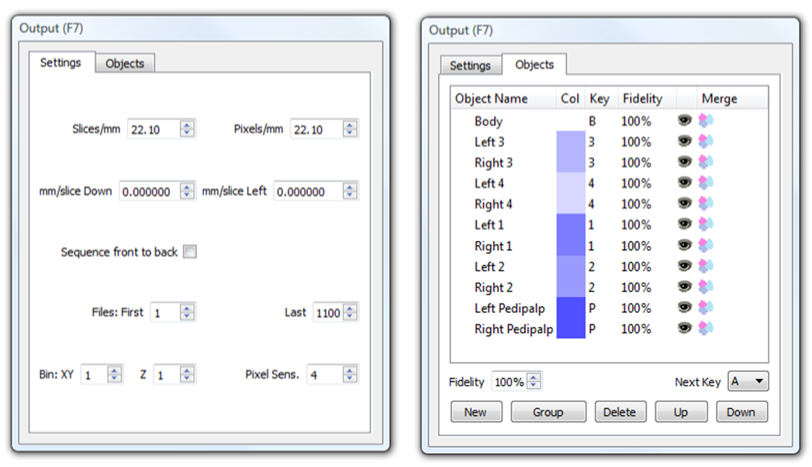
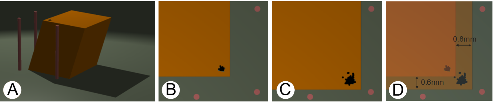

.. _output:

Output
======

Concepts
--------

*SPIERSview:* SPIERSedit does not directly visualise models in three
dimensions, but instead exports models in compact ‘.spv’ file format,
for viewing in SPIERSview (see SPIERSview manual). SPIERSview also
provides facilities to export models as geometries to other software.

*Output Objects*: SPIERSedit exports a series of *Output Objects*, which
are listed in the *Objects* tab of the *Output* panel; these are defined
by the user as combinations of masks and (for multi-segment datasets)
segments. The object will consist of all pixels assigned to any of these
segments that fall into any of these masks. For instance, an object
might list two masks and a ‘void’ segment; it would then comprise any
void pixels with either of the two masks. In most cases however output
objects consist of a single mask and segment, and represent all pixels
in that segment and that mask. By default a single object is created,
representing all pixels in the default mask and the default segment.

*Output Downsampling*: In addition to the dataset downsampling described
in the Basic Concepts section, SPIERSedit supports a second form of
downsampling performed at output time. This *output downsampling*
applies only to the model exported to SPIERSview, and provides
performance gains in SPIERSview as it reduced the complexity of the
model to be displayed. Like dataset downsampling, output downsampling is
defined as an XY and a Z setting. While XY downsampling works in the
same way for both dataset and output downsampling, Z downsampling does
not. A Z-downsampled dataset simply skips files – for example if Z
downsampling is set to 3, only every third file in the sequence is used.
Z-downsampling at output instead merges files; if set to 3, each set of
3 files is merged at output to determine whether any individual pixel is
‘on’ or ‘off’. Output downsampling is additive to dataset downsampling –
if the dataset is downsampled by a factor of 2 and the output is also a
downsampled by a factor of 2, it will in fact be downsampled by a factor
of four from the source data.

*Output Cache*: Outputting models can be time consuming, as SPIERSedit
needs to process data for all slices in the dataset. However once an
output has been performed, SPIERSedit stores (caches) output information
for each slice; for subsequent output operations only slices that have
been altered are processed, and hence output is normally far quicker.
Certain operations (e.g. creating or deleting a new output object) reset
this cache.

Settings Tab
------------

The *Settings* Tab of the *Output* panel (see Fig. 15, left) was
introduced under Basic Concepts.

	
    Figure 15. The Output Panel.* Left; Settings Tab. Right; Object Tab.

*Slices/mm, Pixels/mm*, *Sequence front to back*: See Basic Concepts
(above).

*mm/slice Down* and *mm/slice Left*: See Deskewing (below).

*Files:* *First* and *Last*: restricts output to part of the dataset in
terms of position in the Z direction; by default all files are included,
but often a restricted portion only need be rendered at any one time,
and including fewer files will normally speed up the output and
rendering process.

*Bin: XY* and *Z*: These are the settings for output downsampling within
each image (XY) and between images (Z).

*Pixel Sens.*: This is pixel sensitivity; it controls how output
downsampling combines pixels. With output downsampling on (XY or Z
values > 1), each voxel (3D pixel) output is assembled from Z x XY x XY
threshold image pixels, each of which may be either ‘on’ or ‘off’. Pixel
sensitivity is the number of threshold image pixels that need to be on
before the voxel is turned on. For example if XY and Z are each 3, a
cube of 3 x 3 x 3 = 27 pixels will be reduced to a single voxel. If
Pixel Sens. is set to 1, only one of these 27 pixels need be on to turn
the voxel on. If Pixel Sens. Is set to 14, over half would need to be
turned on. If in doubt, leave Pixel Sens. at 1; using higher values can
however help to reduce noise caused by sporadic scattered pixels.

Objects Tab
-----------

The *Objects* tab of the *Output* panel (see Fig. 15, Right) provides a
list of output objects that that works in a manner similar to the
*Masks* panel.

*Object Name:* This column provides a reference name for the object,
which will appear in the *Objects* Panel of SPIERSview. Edit by
double-clicking. Hovering the mouse over the name of an output object
gives a list of the Masks and Segments that comprise it.

*Col:* The item colour in SPIERSview; edit by double-clicking. Note that
groups can have a colour, though this is only used if they are merged
(see below).

*Key*: The keyboard shortcut key that will be used to show/hide the
object in SPIERSview ([-] means no key assigned). The *Next Key*
dropdown below the main list is the key that will be assigned to the
next object created.

*Fidelity*: The SPIERSview model fidelity; values of less than 100% will
trigger a simplification step in SPIERSview to attempt to reduce the
object's complexity. Values less than 50% are not advised at export (see
SPIERSview manual). The *Fidelity* spinbox below the main list is the
default for new objects.

*Visibility*: The ‘eye’ icon column is used to turn items on and off for
export purposes; invisible items will not be exported.

*Merge*: Groups (see below) can be merged into single output objects,
which are treated by SPIERSview as single fused objects, rendered with
the group colour. This facility allows complex output object to be
created. To merge or unmerge a group, just double click the merge item
of the group or of one of its component objects (in the latter case you
will be asked to confirm that you want the entire group merged).

*Creating a new object*: To create an object for a single-segment
datasets, just select the masks that are to comprise it in the *Masks*
panel then click *New* in the *Objects* tab of the *Output* panel (or
use the *New Output Object* command on the *Output* menu). For
multi-segment datasets the segments that are to comprise the object must
also be selected in the *Segment* panel before the object is created.
*The masks and segments comprising an object cannot be edited after it
is created – if need changing the object must be deleted and recreated.*
Objects are created with name based on the masks they use. The keyboard
shortcut is set from the *Next Key* drop-down (which is also incremented
after each object is created), and the fidelity is set from the Fidelity
spin-box. Colour is based on the component masks.

*Deleting objects*: Select an object or objects in the Object list, then
click the *Delete* button or use the *Delete Output Object* command on
the *Output* menu. These commands are also used to delete empty groups.

*Selecting objects*: One or more objects can be selected by left
clicking on any column of the *Objects* panel. To select multiple
objects use Ctrl-click or Shift-click. Selection is indicated by an
underlined object name. Selection of masks is used for bulk deleting and
for grouping operations.

*Re-ordering objects list:* Objects can be moved up and down the list by
selecting an object and using the *Up* and *Down* buttons. This
reordering affects how the masks appear both in this list and in
SPIERSview. Objects within groups can be moved up or down with a group.

*Grouping*: SPIERSedit (and SPIERSview) support groups of objects; the
utility of grouping is discussed in the SPIERSview manual, but
SPIERSedit also uses groups as a precursor to the creation of merged
objects (see above). To create a group, select objects then click the
*Group* button (or use the *Group* command in the *Output* menu). To
remove objects from a group, select them and use the *Remove from Group*
command in the *Output* menu. Groups can be created within other groups.
Note that the grouping facilities in SPIERSedit are a little less
sophisticated than those in SPIERSview; normal practice is to export
objects ungrouped (merged objects excepted) and perform grouping in
SPIERSview.

Output Commands
---------------

Three variants of the output command exist in the output menu.

*Export SPIERSview*: Prompts the user for a filename (with an ‘.spv’
extension), and exports to this file.

*Export SPIERSview and Launch*: As above, but after Export SPIERSview is
launched to view the file.

*View in SPIERSview*: The file is exported to a standard name and
location (as ‘temp.spv’ in the working images folder); after export
SPIERSview is launched to view the file. This is the simplest export
option, and the normal one to use, as once the file has been rendered by
SPIERSview the latter program can then save a copy elsewhere if this is
required.

*Old export code*: An older version of the Export system is available;
this can be activated (for all three of the above commands) by ticking
the *Use Old Exporting Code* option in the *Output* menu. With this
enabled output will be substantially slower (and the cache system
described in Concepts will not be used), but if the user is experiencing
crashes with output (which typically relate to restricted available
memory) they may find that the old code succeeds where the newer version
fails.

Deskewing
---------

*SPIERSedit* incorporates a system to correct for skew in models caused
by ‘drift’ of fiduciary markings in serial grinding datasets. These
corrections are best explained by example – see Figure 16 (overleaf).
Figure 16A shows a block in the image that contains a fossil on its left
corner; it has edges cut as fiduciary markers, but these are not at
exactly 90 degrees to the plane in which the specimen will be serially
ground. This means that the edges will ‘drift’ steadily when the
specimen is ground and photographed, and if these edges are used for
alignment, the fossil will consequently be skewed when reconstructed.

	
    Figure 16. Deskewing example.* A, block prior to grinding with fiduciary edges not at 90 degrees to direction of grinding. B. Serial grinding image #10. C. Serial grinding image #70. D. Movement between B and C.

The vertical cylinders represent fixed points of reference. They will
not appear in normal photographs of the fossil as they are too far away
(normal images will be zoomed in on this corner for maximum resolution).
However, suppose that the images B and C were captured at slices 10 and
70 of the grinding run (at some lower magnification). By overlaying
these images (and knowing the scale of the image) we can measure how
much the edges have moved over these 60 slices – in this case 0.8mm to
the right and 0.6mm downwards. This example is a little artificial, but
these sorts of errors do occur in serial grinding datasets, and do
require correction.

Deskew values are entered into the *mm/Slice Down* and *mm/Slice Left*
boxes on the *Settings* tab of the *Output* panel. In this example
0.01333 (0.8mm / 60 slices) should be entered for mm/Slice down, and
-0.01 (0.6mm / 60 slice) for mm/Slice left - note the use of a negative
value for left drift as the edge is actually moving right not left.