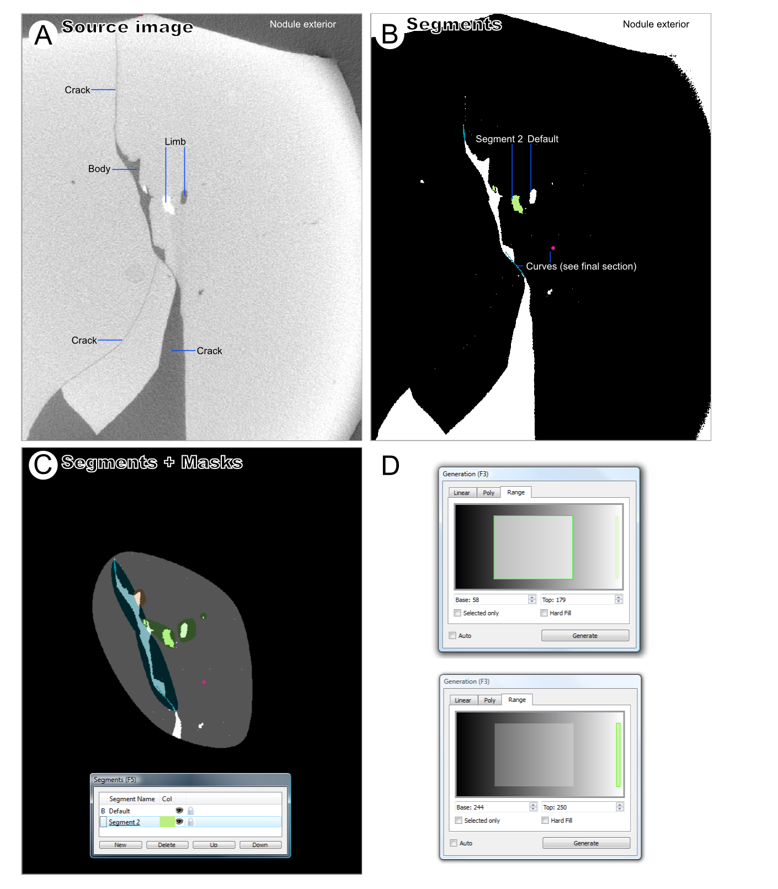
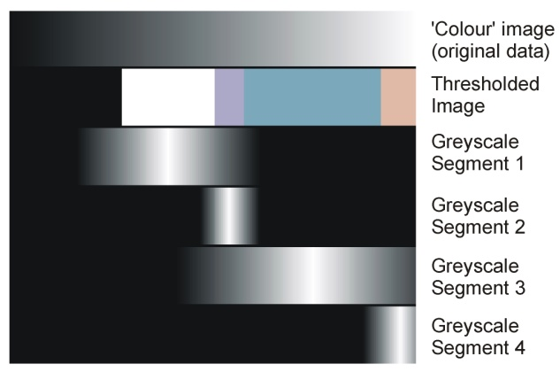

.. _rangegeneration:

Range Generation
================

Concept
-------

Range generation is a generation mode primarily intended for
multi-segment monochrome (e.g. CT) datasets, although it can also be
used on colour datasets. In range generation the user splits up the
range of possible greyscale values (from black to white) in the source
image into sections corresponding to different types of material, and
assigns segments to each. Figure 12 shows an example of one such
dataset, where a fossil is preserved as both void (dark) and pyrite
(white), and two segments are defined using the range system to cover
the darker pixels (‘Default’) and the lighter ones (‘Segment 2’).

To implement range-based generation, the user first creates the required
number of segments (see above). With the *Generation* panel in *Range*
mode (the Range tab selected), the positions of the segments in the
black-white gradient can be set using the controls detailed below; in
practice it is normally best to start with a *Distribute Over Range*
command to ‘separate’ the segments, which by default will be overlapping
and not arranged in any sensible way. In the same way that linear
generation for single-segment datasets is normally initiated by finding
optimal values on a single ‘test’ slice, range generation is also best
set up in this way, using the *Auto* tick box to apply changes as they
are made until optimum settings have been determined, and the Range
generation can be applied to the same dataset. Note that segment
boundaries are allowed to overlap, but this is rarely a sensible thing
to do, and should be avoided unless the user is confident they know what
they are doing!

Range Generation (i.e. clicking Generate or using *Auto* and making
changes) affects all selected slices as does normal generation, but
unlike generation in *Linear* or Poly\ *n*\ omial modes it also affects
ALL segments, not just the selected one.

Range Generation Panel
----------------------

The *Generation* Panel in range mode consists of a shaded strip running
from black to white (representing the range of shades to be assigned),
together with *Base* and *Top* ‘spinboxes’ and two tick boxes. Segments
are shown on the strip occupying the range currently assigned to them;
the currently selected segment (the one in the ‘L’ drop-down of the
*Main Toolbox* panel) is shown in a lighter colour, with a green border,
and the Base and Top values shown apply to this segment, representing
the range on a scale covered where 0=black, 255=white.

*Selecting Segments*: Left-clicking on the coloured block representing
the segment on the shaded strip will select it (i.e. have the same
effect as selecting it in the L dropdown on the *Main Toolbox* panel).

*Dragging boundaries.* Using the either mouse button you can pick up and
drag the left and right margins of segment blocks in the shaded strip to
reposition them (i.e. change the Base and Top values of the segments).
If you use the left mouse button, margins will ‘snap’ onto adjacent
margins to ensure no gap in between, and if you drag a margin already in
contact with another, both will move together. If you use the right
mouse button instead, this ‘intelligent’ snapping and combined dragging
behaviour is disabled.

*Using Base and Top*: With a segment selected, Base and Top values can
be altered directly using the spinboxes; no snapping behaviour is
implemented.

*Selected only*: With this box ticked generation affects only the
selected segment, not all segments. This option is not normally helpful,
and is included only for completeness.

*Hard fill*: Generates in hard rather than soft-fill mode – see below.

	
    Figure 12. Multi-segment CT dataset handled using range generation.* A; Source Image. B; Thresholded image showing multi-segment interpretation. C; Segmented image with masks overlayed; D, Range generation settings used, top shows ‘Default’ segment selected, bottom shows ‘Segment 2’ selected.

*Distributing segments.* The *Distribute over range* command takes all
segments selected in the *Segments* panel and distributes them evenly
over a specified range (by default the entire range, 0 to 255). This is
primarily useful when setting segments up initially, as a prelude to
moving their boundaries to optimal positions.

Hard and Soft Fills
-------------------

By default, *Range* generation uses a ‘soft fill’ algorithm to generate
each working image (recall that there is one working image per segment).
If source image pixels are at the midpoint of the range, the
corresponding working image pixels are fully white. As source image
pixel values move away from this midpoint, the corresponding generated
pixels get darker linearly, crossing the threshold value (of 127) at the
correct points (the specified Top and Base values for the segment), and
tailing away to 0 beyond that. Figure 13 provides a visual explanation
of soft-fill values for a hypothetical four-segment dataset

	
    Figure 13. Soft-fill range generation. Top; the grayscale range of the source images. Second row; Segment definitions for four segments. Bottom four rows; working image levels generated for each segment for each source image level.

The point of soft-fill range generation is to enable the brighten brush
to be on range-generated dataset. If used on working images generated in
this way, it will function to ‘bring out’ a segment, pushing boundaries
locally up and down. This allows subtle post-editing after generation.

When generating a single segment, however, soft-fill is not always
appropriate; pixels within the specified range might not display as the
expected segment if another segment has been artificially brightened at
that point. To ensure that all pixels in the designated range are
assigned correctly, tick the ‘hard fill’ box. With hard-fill in
operation, SPIERSedit sets all pixels in the designated range to pure
white in the segment greyscale file, and all outside it to pure black,
ensuring that this problem does not arise.